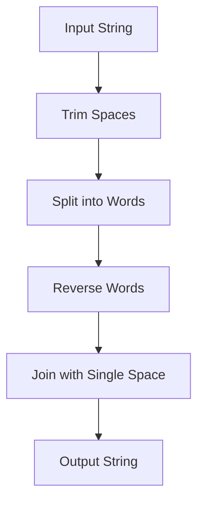

## Table of Contents
1. [Problem Statement](#problem-statement)
2. [Approach](#approach)
3. [Algorithm](#algorithm)
4. [Flowchart](#flowchart)
5. [Implementations](#implementations)
   - [Go](#implementation-in-go)
   - [Java](#implementation-in-java)
6. [Explanation](#explanation)
7. [Time and Space Complexity](#time-and-space-complexity)
8. [Conclusion](#conclusion)


## Problem Statement

Given an input string `s`, reverse the order of the words. A word is defined as a sequence of non-space characters. The words in `s` will be separated by at least one space.

Return a string where the words appear in reverse order, but the characters within each word remain unchanged. The output string should not contain leading or trailing spaces, and words should be separated by a single space.

### Example 1:

```text
Input: s = "the sky is blue"
Output: "blue is sky the"
```

### Example 2:

```text
Input: s = "  hello world  "
Output: "world hello"
```

### Constraints:

- `1 <= s.length <= 10^4`
- `s` contains English letters (upper-case and lower-case), digits, and spaces.
- There is at least one word in `s`.

## Approach

1. **Trim spaces**: Remove leading and trailing spaces.
2. **Split words**: Convert the string into an array of words.
3. **Reverse order**: Reverse the words while maintaining character order.
4. **Join words**: Reconstruct the string with a single space between words.

## Algorithm

1. Remove leading and trailing spaces.
2. Split the string into words.
3. Reverse the order of words.
4. Join them back into a single string.

## Flowchart



## Implementations

### Implementation in Go

```go
package main

import (
	"fmt"
	"strings"
)

func reverseWords(s string) string {
	words := strings.Fields(s)
	for i, j := 0, len(words)-1; i < j; i, j = i+1, j-1 {
		words[i], words[j] = words[j], words[i]
	}
	return strings.Join(words, " ")
}

func main() {
	fmt.Println(reverseWords("  hello world  ")) // Output: "world hello"
}
```

### Implementation in Java

```java
public class ReverseWords {
    public static String reverseWords(String s) {
        String[] words = s.trim().split("\\s+");
        StringBuilder result = new StringBuilder();
        for (int i = words.length - 1; i >= 0; i--) {
            result.append(words[i]);
            if (i > 0) {
                result.append(" ");
            }
        }
        return result.toString();
    }

    public static void main(String[] args) {
        System.out.println(reverseWords("  hello world  ")); // Output: "world hello"
    }
}
```

## Explanation

- **Golang**: Uses `strings.Fields()` to split words and a simple two-pointer technique to reverse them.
- **Java**: Uses `trim()` and `split("\\s+")` to clean up spaces and reverses the array of words using a loop.

## Time and Space Complexity

- **Time Complexity**: `O(N)`, where `N` is the length of the string (splitting and reversing takes linear time).
- **Space Complexity**: `O(N)`, since we store words in an array.

## Conclusion

This problem is a classic example of string manipulation. It teaches efficient use of built-in methods to process strings, handle whitespace, and reverse arrays effectively.
