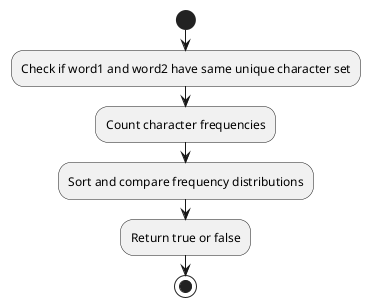

## Table of Contents

1. [Problem Statement](#problem-statement)
2. [Approach](#approach)
3. [Algorithm](#algorithm)
4. [Flowchart](#flowchart)
5. [Implementations](#implementations)
   - [Go](#implementation-in-go)
   - [Java](#implementation-in-java)
6. [Explanation](#explanation)
7. [Time and Space Complexity](#time-and-space-complexity)
8. [Conclusion](#conclusion)

## Problem Statement

Two strings are considered close if you can attain one from the other using the following operations:

1. **Operation 1:** Swap any two existing characters.
2. **Operation 2:** Transform every occurrence of one existing character into another existing character, and do the same with the other character.

Given two strings, `word1` and `word2`, return `true` if `word1` and `word2` are close, and `false` otherwise.

### Example 1:

**Input:** word1 = "abc", word2 = "bca"  
**Output:** true  

### Example 2:

**Input:** word1 = "a", word2 = "aa"  
**Output:** false  

### Example 3:

**Input:** word1 = "cabbba", word2 = "abbccc"  
**Output:** true  

### Constraints:

- `1 <= word1.length, word2.length <= 10^5`
- `word1` and `word2` contain only lowercase English letters.

## Approach

1. If the lengths of `word1` and `word2` are different, return `false`.
2. Check if both words have the same unique character set.
3. Count the frequency of characters in both words.
4. Compare sorted frequency distributions.

## Algorithm

1. Check if `word1` and `word2` have the same set of unique characters.
2. Count the occurrences of each character in both strings.
3. Sort the frequency counts and compare them.
4. Return `true` if they match, otherwise return `false`.

## Flowchart



## Implementations

### Implementation in Go

```go
func closeStrings(word1 string, word2 string) bool {
    if len(word1) != len(word2) {
        return false
    }
    
    freq1, freq2 := make(map[rune]int), make(map[rune]int)
    unique1, unique2 := make(map[rune]bool), make(map[rune]bool)
    
    for _, ch := range word1 {
        freq1[ch]++
        unique1[ch] = true
    }
    
    for _, ch := range word2 {
        freq2[ch]++
        unique2[ch] = true
    }
    
    if !reflect.DeepEqual(unique1, unique2) {
        return false
    }
    
    counts1, counts2 := []int{}, []int{}
    for _, v := range freq1 {
        counts1 = append(counts1, v)
    }
    for _, v := range freq2 {
        counts2 = append(counts2, v)
    }
    
    sort.Ints(counts1)
    sort.Ints(counts2)
    
    return reflect.DeepEqual(counts1, counts2)
}
```

### Implementation in Java

```java
import java.util.*;

class Solution {
    public boolean closeStrings(String word1, String word2) {
        if (word1.length() != word2.length()) return false;
        
        int[] freq1 = new int[26], freq2 = new int[26];
        Set<Character> set1 = new HashSet<>(), set2 = new HashSet<>();
        
        for (char ch : word1.toCharArray()) {
            freq1[ch - 'a']++;
            set1.add(ch);
        }
        
        for (char ch : word2.toCharArray()) {
            freq2[ch - 'a']++;
            set2.add(ch);
        }
        
        if (!set1.equals(set2)) return false;
        
        Arrays.sort(freq1);
        Arrays.sort(freq2);
        
        return Arrays.equals(freq1, freq2);
    }
}
```

## Explanation

By checking the character set and comparing sorted frequency distributions, we determine if two words are close.

## Time and Space Complexity

- **Time Complexity:** O(n log n) due to sorting.
- **Space Complexity:** O(1) since we use fixed auxiliary space.

## Conclusion

This method efficiently checks whether two strings are close using sorting and frequency comparison.

