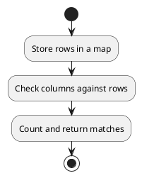

## Table of Contents

1. [Problem Statement](#problem-statement)
2. [Approach](#approach)
3. [Algorithm](#algorithm)
4. [Flowchart](#flowchart)
5. [Implementations](#implementations)
   - [Go](#implementation-in-go)
   - [Java](#implementation-in-java)
   - [Python](#implementation-in-python)
6. [Explanation](#explanation)
7. [Time and Space Complexity](#time-and-space-complexity)
8. [Conclusion](#conclusion)

## Problem Statement

Given a `0`-indexed `n x n` integer matrix `grid`, return the number of pairs `(r_i, c_j)` such that row `r_i` and column `c_j` are equal.

### Example 1:

**Input:** `grid = [[3,2,1],[1,7,6],[2,7,7]]`
**Output:** `1`

### Example 2:

**Input:** `grid = [[3,1,2,2],[1,4,4,5],[2,4,2,2],[2,4,2,2]]`
**Output:** `3`

### Constraints:

- `n == grid.length == grid[i].length`
- `1 <= n <= 200`
- `1 <= grid[i][j] <= 10^5`

## Approach

1. Store the rows of the matrix in a frequency map.
2. Extract each column and check its frequency in the stored rows.
3. Sum up the number of matching row-column pairs.

## Algorithm

1. Use a `map` to store the frequency of each row.
2. Iterate through columns and compare them with the stored rows.
3. Count the matches.

## Flowchart



## Implementations

### Implementation in Go

```go
func equalPairs(grid [][]int) int {
    count := 0
    rowFreq := make(map[string]int)
    
    for _, row := range grid {
        key := fmt.Sprintf("%v", row)
        rowFreq[key]++
    }
    
    n := len(grid)
    for j := 0; j < n; j++ {
        col := make([]int, n)
        for i := 0; i < n; i++ {
            col[i] = grid[i][j]
        }
        key := fmt.Sprintf("%v", col)
        count += rowFreq[key]
    }
    
    return count
}
```

### Implementation in Java

```java
import java.util.*;

class Solution {
    public int equalPairs(int[][] grid) {
        int n = grid.length;
        int count = 0;
        Map<String, Integer> rowFreq = new HashMap<>();
        
        for (int[] row : grid) {
            String key = Arrays.toString(row);
            rowFreq.put(key, rowFreq.getOrDefault(key, 0) + 1);
        }
        
        for (int j = 0; j < n; j++) {
            int[] col = new int[n];
            for (int i = 0; i < n; i++) {
                col[i] = grid[i][j];
            }
            String key = Arrays.toString(col);
            count += rowFreq.getOrDefault(key, 0);
        }
        
        return count;
    }
}
```

### Implementation in Python

```python
from collections import defaultdict

class Solution:
    def equalPairs(self, grid: list[list[int]]) -> int:
        n = len(grid)
        count = 0
        row_freq = defaultdict(int)
        
        for row in grid:
            key = tuple(row)
            row_freq[key] += 1
        
        for j in range(n):
            col = [grid[i][j] for i in range(n)]
            key = tuple(col)
            count += row_freq[key]
        
        return count

```

## Explanation

We use a map to store row frequencies and compare them with column representations to count matches.

## Time and Space Complexity

- **Time Complexity:** `O(n^2)` since we process each row and column.
- **Space Complexity:** `O(n^2)` for storing rows and columns in the map.

## Conclusion

This approach efficiently counts equal row-column pairs using hash maps.

