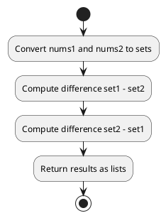

## Table of Contents

1. [Problem Statement](#problem-statement)
2. [Approach](#approach)
3. [Algorithm](#algorithm)
4. [Flowchart](#flowchart)
5. [Implementations](#implementations)
   - [Go](#implementation-in-go)
   - [Java](#implementation-in-java)
6. [Explanation](#explanation)
7. [Time and Space Complexity](#time-and-space-complexity)
8. [Conclusion](#conclusion)

## Problem Statement


Given two 0-indexed integer arrays `nums1` and `nums2`, return a list `answer` of size 2 where:

- `answer[0]` is a list of all distinct integers in `nums1` which are not present in `nums2`.
- `answer[1]` is a list of all distinct integers in `nums2` which are not present in `nums1`.

The integers in the lists may be returned in any order.

### Example 1:

**Input:** nums1 = [1,2,3], nums2 = [2,4,6]  
**Output:** [[1,3],[4,6]]  
**Explanation:**
- For `nums1`, `2` is in `nums2`, but `1` and `3` are not, so `answer[0] = [1,3]`.
- For `nums2`, `2` is in `nums1`, but `4` and `6` are not, so `answer[1] = [4,6]`.

### Example 2:

**Input:** nums1 = [1,2,3,3], nums2 = [1,1,2,2]  
**Output:** [[3],[]]  
**Explanation:**
- `nums1` contains `3` which is not in `nums2`, so `answer[0] = [3]`.
- Every integer in `nums2` is in `nums1`, so `answer[1] = []`.

### Constraints:

- `1 <= nums1.length, nums2.length <= 1000`
- `-1000 <= nums1[i], nums2[i] <= 1000`

## Approach

1. Use sets to find distinct elements in `nums1` and `nums2`.
2. Compute the difference `nums1 - nums2` and `nums2 - nums1`.
3. Return the differences as two lists.

## Algorithm

1. Convert `nums1` and `nums2` into sets.
2. Compute `set(nums1) - set(nums2)` and `set(nums2) - set(nums1)`.
3. Convert results into lists and return them.

## Flowchart



## Implementations

### Implementation in Go

```go
func findDifference(nums1 []int, nums2 []int) [][]int {
    set1, set2 := make(map[int]bool), make(map[int]bool)
    
    for _, num := range nums1 {
        set1[num] = true
    }
    
    for _, num := range nums2 {
        set2[num] = true
    }
    
    var res1, res2 []int
    
    for num := range set1 {
        if !set2[num] {
            res1 = append(res1, num)
        }
    }
    
    for num := range set2 {
        if !set1[num] {
            res2 = append(res2, num)
        }
    }
    
    return [][]int{res1, res2}
}
```

### Implementation in Java

```java
import java.util.*;

class Solution {
    public List<List<Integer>> findDifference(int[] nums1, int[] nums2) {
        Set<Integer> set1 = new HashSet<>(), set2 = new HashSet<>();
        
        for (int num : nums1) set1.add(num);
        for (int num : nums2) set2.add(num);
        
        List<Integer> res1 = new ArrayList<>(), res2 = new ArrayList<>();
        
        for (int num : set1) {
            if (!set2.contains(num)) res1.add(num);
        }
        
        for (int num : set2) {
            if (!set1.contains(num)) res2.add(num);
        }
        
        return Arrays.asList(res1, res2);
    }
}
```

## Explanation

By using sets, we efficiently find the unique elements in each array that do not appear in the other. This results in an optimal O(n) solution.

## Time and Space Complexity

- **Time Complexity:** O(n) because we iterate through each array once.
- **Space Complexity:** O(n) due to the storage of elements in sets.

## Conclusion

This approach efficiently finds the difference between two arrays using set operations, ensuring optimal performance.

