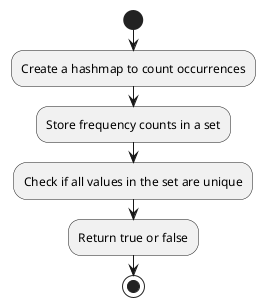

## Table of Contents

1. [Problem Statement](#problem-statement)
2. [Approach](#approach)
3. [Algorithm](#algorithm)
4. [Flowchart](#flowchart)
5. [Implementations](#implementations)
   - [Go](#implementation-in-go)
   - [Java](#implementation-in-java)
6. [Explanation](#explanation)
7. [Time and Space Complexity](#time-and-space-complexity)
8. [Conclusion](#conclusion)

## Problem Statement


Given an array of integers `arr`, return `true` if the number of occurrences of each value in the array is unique or `false` otherwise.

### Example 1:

**Input:** arr = [1,2,2,1,1,3]  
**Output:** true  
**Explanation:** The value `1` has 3 occurrences, `2` has 2, and `3` has 1. No two values have the same number of occurrences.

### Example 2:

**Input:** arr = [1,2]  
**Output:** false  

### Example 3:

**Input:** arr = [-3,0,1,-3,1,1,1,-3,10,0]  
**Output:** true  

### Constraints:

- `1 <= arr.length <= 1000`
- `-1000 <= arr[i] <= 1000`

## Approach

1. Count the occurrences of each number in `arr` using a hashmap.
2. Store the frequency counts in a set.
3. If all frequency counts are unique, return `true`; otherwise, return `false`.

## Algorithm

1. Create a hashmap to count occurrences of each number.
2. Store the counts in a set to check for uniqueness.
3. Return `true` if all counts are unique, otherwise return `false`.

## Flowchart



## Implementations

### Implementation in Go

```go
func uniqueOccurrences(arr []int) bool {
    countMap := make(map[int]int)
    
    for _, num := range arr {
        countMap[num]++
    }
    
    occurrenceSet := make(map[int]bool)
    
    for _, count := range countMap {
        if occurrenceSet[count] {
            return false
        }
        occurrenceSet[count] = true
    }
    
    return true
}
```

### Implementation in Java

```java
import java.util.*;

class Solution {
    public boolean uniqueOccurrences(int[] arr) {
        Map<Integer, Integer> countMap = new HashMap<>();
        
        for (int num : arr) {
            countMap.put(num, countMap.getOrDefault(num, 0) + 1);
        }
        
        Set<Integer> occurrenceSet = new HashSet<>(countMap.values());
        
        return countMap.size() == occurrenceSet.size();
    }
}
```

## Explanation

By utilizing a hashmap to store occurrences and a set to check uniqueness, we achieve an efficient solution.

## Time and Space Complexity

- **Time Complexity:** O(n) since we traverse the array once.
- **Space Complexity:** O(n) due to the storage of elements in a hashmap and set.

## Conclusion

This approach efficiently determines whether the occurrences of elements in an array are unique using set operations.

