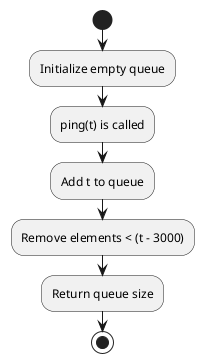

## Table of Contents

1. [Problem Statement](#problem-statement)
2. [Approach](#approach)
3. [Algorithm](#algorithm)
4. [Flowchart](#flowchart)
5. [Implementations](#implementations)
   - [Go](#implementation-in-go)
   - [Java](#implementation-in-java)
6. [Explanation](#explanation)
7. [Time and Space Complexity](#time-and-space-complexity)
8. [Conclusion](#conclusion)

## Problem Statement


You have a `RecentCounter` class which counts the number of recent requests within a certain time frame.

Implement the `RecentCounter` class:

- `RecentCounter()`: Initializes the counter with zero recent requests.
- `int ping(int t)`: Adds a new request at time `t` (milliseconds) and returns the number of requests in the past 3000 milliseconds (including the new request). Specifically, it returns the number of requests in the range `[t - 3000, t]`.

It is guaranteed that every call to `ping` uses a strictly larger value of `t` than the previous call.

### Example 1:

**Input:**
```
["RecentCounter", "ping", "ping", "ping", "ping"]
[[], [1], [100], [3001], [3002]]
```
**Output:**
```
[null, 1, 2, 3, 3]
```

### Constraints:

- `1 <= t <= 10^9`
- Each test case will call `ping` with strictly increasing values of `t`.
- At most `10^4` calls will be made to `ping`.

## Approach

1. Use a queue to store timestamps of requests.
2. When `ping(t)` is called:
   - Remove outdated requests (`< t - 3000`).
   - Return the size of the queue.

## Algorithm

1. Initialize a queue to store timestamps.
2. On each `ping(t)` call:
   - Enqueue `t`.
   - Remove timestamps older than `t - 3000`.
   - Return the queue size.

## Flowchart



## Implementations

### Implementation in Go

```go
type RecentCounter struct {
    queue []int
}

func Constructor() RecentCounter {
    return RecentCounter{queue: []int{}}
}

func (this *RecentCounter) Ping(t int) int {
    this.queue = append(this.queue, t)
    for this.queue[0] < t-3000 {
        this.queue = this.queue[1:]
    }
    return len(this.queue)
}
```

### Implementation in Java

```java
import java.util.*;

class RecentCounter {
    private Queue<Integer> queue;
    
    public RecentCounter() {
        queue = new LinkedList<>();
    }
    
    public int ping(int t) {
        queue.add(t);
        while (queue.peek() < t - 3000) {
            queue.poll();
        }
        return queue.size();
    }
}
```

## Explanation

Using a queue ensures efficient request handling while keeping track of only the relevant timestamps.

## Time and Space Complexity

- **Time Complexity:** `O(1)` average, as each request is processed once.
- **Space Complexity:** `O(n)`, where `n` is the number of requests in the last 3000 milliseconds.

## Conclusion

This queue-based approach efficiently counts recent calls while maintaining optimal performance.

