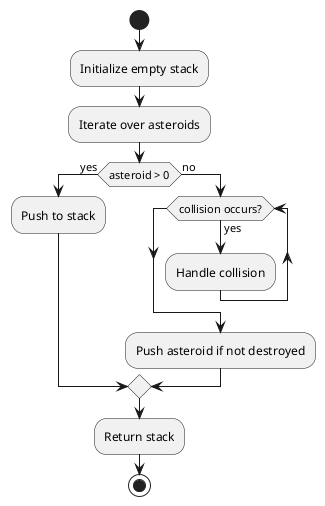

## Table of Contents

1. [Problem Statement](#problem-statement)
2. [Approach](#approach)
3. [Algorithm](#algorithm)
4. [Flowchart](#flowchart)
5. [Implementations](#implementations)
   - [Go](#implementation-in-go)
   - [Java](#implementation-in-java)
   - [Python](#implementation-in-python)
6. [Explanation](#explanation)
7. [Time and Space Complexity](#time-and-space-complexity)
8. [Conclusion](#conclusion)

## Problem Statement

We are given an array `asteroids` of integers representing asteroids in a row. The indices of the asteroids in the array represent their relative position in space.

For each asteroid, the absolute value represents its size, and the sign represents its direction (positive meaning right, negative meaning left). Each asteroid moves at the same speed.

Find out the state of the asteroids after all collisions. If two asteroids meet, the smaller one will explode. If both are the same size, both will explode. Two asteroids moving in the same direction will never meet.

### Example 1:

**Input:** `asteroids = [5,10,-5]`
**Output:** `[5,10]`

### Example 2:

**Input:** `asteroids = [8,-8]`
**Output:** `[]`

### Example 3:

**Input:** `asteroids = [10,2,-5]`
**Output:** `[10]`

### Constraints:

- `2 <= asteroids.length <= 10^4`
- `-1000 <= asteroids[i] <= 1000`
- `asteroids[i] != 0`

## Approach

1. Use a stack to simulate asteroid collisions.
2. Iterate through the asteroids:
   - If the stack is empty or the asteroid moves right (`> 0`), push it onto the stack.
   - If the asteroid moves left (`< 0`), check for collisions with the top of the stack.
   - Continue popping from the stack if a collision occurs until conditions are met.
3. Return the stack as the final state of the asteroids.

## Algorithm

1. Initialize an empty stack.
2. Traverse the `asteroids` array:
   - If the asteroid is positive, push it onto the stack.
   - If the asteroid is negative:
     - Pop from the stack while the top asteroid is positive and smaller in magnitude.
     - If the top asteroid is equal in size, remove both.
     - If no more collisions occur, push the asteroid onto the stack.
3. Return the stack as the result.

## Flowchart



## Implementations

### Implementation in Go

```go
func asteroidCollision(asteroids []int) []int {
    stack := []int{}
    for _, ast := range asteroids {
        for len(stack) > 0 && ast < 0 && stack[len(stack)-1] > 0 {
            top := stack[len(stack)-1]
            if top < -ast {
                stack = stack[:len(stack)-1]
                continue
            } else if top == -ast {
                stack = stack[:len(stack)-1]
            }
            break
        }
        if len(stack) == 0 || ast > 0 || stack[len(stack)-1] < 0 {
            stack = append(stack, ast)
        }
    }
    return stack
}
```

### Implementation in Java

```java
class Solution {
    public int[] asteroidCollision(int[] asteroids) {
        Stack<Integer> stack = new Stack<>();
        for (int ast : asteroids) {
            while (!stack.isEmpty() && ast < 0 && stack.peek() > 0) {
                int top = stack.pop();
                if (top > -ast) {
                    stack.push(top);
                    ast = 0;
                } else if (top == -ast) {
                    ast = 0;
                }
            }
            if (ast != 0) {
                stack.push(ast);
            }
        }
        return stack.stream().mapToInt(i -> i).toArray();
    }
}
```

### Implementation in Python
```python
from typing import List

class Solution:
    def asteroidCollision(self, asteroids: List[int]) -> List[int]:
        stack = []
        for ast in asteroids:
            while stack and ast < 0 < stack[-1]:
                top = stack.pop()
                if top > -ast:
                    stack.append(top)
                    ast = 0
                    break
                elif top == -ast:
                    ast = 0
                    break
            if ast != 0:
                stack.append(ast)
        return stack
```


## Explanation

Using a stack ensures efficient handling of asteroid collisions by keeping track of active asteroids and resolving conflicts iteratively.

## Time and Space Complexity

- **Time Complexity:** `O(n)`, as we traverse the array once and perform stack operations.
- **Space Complexity:** `O(n)`, for storing asteroids in the stack.

## Conclusion

This stack-based approach efficiently handles asteroid collisions, determining the final state in linear time.

