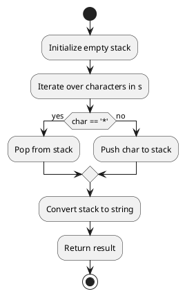

## Table of Contents

1. [Problem Statement](#problem-statement)
2. [Approach](#approach)
3. [Algorithm](#algorithm)
4. [Flowchart](#flowchart)
5. [Implementations](#implementations)
   - [Go](#implementation-in-go)
   - [Java](#implementation-in-java)
   - [Python](#implementation-in-python)
6. [Explanation](#explanation)
7. [Time and Space Complexity](#time-and-space-complexity)
8. [Conclusion](#conclusion)

## Problem Statement


You are given a string `s`, which contains stars `*`.

In one operation, you can:

- Choose a star in `s`.
- Remove the closest non-star character to its left, as well as remove the star itself.

Return the string after all stars have been removed.

### Example 1:

**Input:** `s = "leet**cod*e"`
**Output:** `"lecoe"`

### Example 2:

**Input:** `s = "erase*****"`
**Output:** `""`

### Constraints:

- `1 <= s.length <= 10^5`
- `s` consists of lowercase English letters and stars `*`.

## Approach

1. Use a stack to process the string efficiently.
2. Iterate through the string:
   - If the character is `*`, pop the last element from the stack.
   - Otherwise, push it onto the stack.
3. Convert the stack to a string and return the result.

## Algorithm

1. Initialize an empty stack.
2. Traverse the string:
   - If the character is `*`, pop from the stack.
   - Otherwise, push the character onto the stack.
3. Return the stack's contents as a string.

## Flowchart



## Implementations

### Implementation in Go

```go
func removeStars(s string) string {
    stack := []rune{}
    for _, ch := range s {
        if ch == '*' {
            if len(stack) > 0 {
                stack = stack[:len(stack)-1]
            }
        } else {
            stack = append(stack, ch)
        }
    }
    return string(stack)
}
```

### Implementation in Java

```java
class Solution {
    public String removeStars(String s) {
        StringBuilder stack = new StringBuilder();
        for (char ch : s.toCharArray()) {
            if (ch == '*') {
                stack.deleteCharAt(stack.length() - 1);
            } else {
                stack.append(ch);
            }
        }
        return stack.toString();
    }
}
```

### Implementation in Python

```python
class Solution:
    def removeStars(self, s: str) -> str:
        stack = []
        for ch in s:
            if ch == '*':
                stack.pop()
            else:
                stack.append(ch)
        return ''.join(stack)
```


## Explanation

Using a stack-like approach ensures efficient removal of characters without needing complex string manipulations.

## Time and Space Complexity

- **Time Complexity:** `O(n)`, as we traverse the string once.
- **Space Complexity:** `O(n)`, for storing the result in a stack.

## Conclusion

This method efficiently removes stars and their preceding characters using a stack-based approach.

