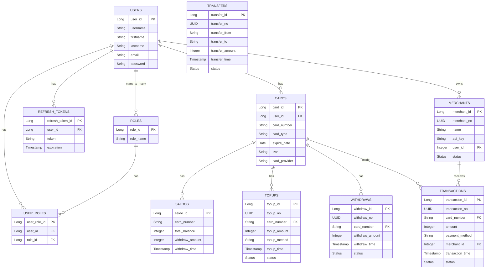

Here is a fluent English version with improved structure, terminology consistency, and a more professional engineering tone:

---

# Spring Boot Payment Gateway API

**A Robust Backend API for a Digital Payment Ecosystem**

The **Spring Boot Payment Gateway API** is a high-performance backend service designed to support a complete payment gateway ecosystem. Built using **Java 21** and **Spring Boot**, it provides full lifecycle financial capabilities, including JWT-based authentication, user and merchant management, card management, balance tracking, and multi-type financial transaction processing.

---

## Key Features

### Authentication & Security

* **JWT Authentication**: Secure user registration and login using JSON Web Tokens.
* **Role-Based Access Control (RBAC)**: Fine-grained access control ensuring secure access to sensitive endpoints based on user roles (user, admin, merchant).

---

### User & Merchant Management

* **User Profiles**: Registration, profile management, and user information handling.
* **Merchant Integration**: Merchant creation and management with dedicated API keys for external system integration.

---

### Card & Balance Management

* **Card Management**: Secure storage and management of user payment cards.
* **Balance Tracking**: Real-time balance monitoring for each user account or card.

---

### Financial Transaction Processing

* **Merchant Payments**: Direct payment processing from users to merchants.
* **Top-Up Operations**: Account balance top-ups using multiple payment methods.
* **Transfers**: Peer-to-peer fund transfers between users.
* **Withdrawals**: Secure withdrawal of funds from the system to external accounts.

---

## Technology Stack

* **Language**: Java 21
* **Framework**: Spring Boot 3.x
* **Security**: Spring Security with JWT
* **ORM / Data Access**: Spring Data JPA (Hibernate)
* **Database**: PostgreSQL
* **Build Tool**: Maven
* **API Documentation**: Springdoc OpenAPI (Swagger UI)

---

## Data Architecture & ERD

The database schema is designed to ensure transactional integrity, financial consistency, and strong relational modeling across users, merchants, and payment operations.



---

## API Documentation

The API is fully documented using **Swagger UI**, providing interactive endpoint exploration, request/response schemas, and model-level visibility for easier integration and testing.


---

## Getting Started

### Prerequisites

* Java JDK 21+
* Apache Maven
* PostgreSQL database (running locally or remotely)

---

### Installation & Execution

#### 1. Clone the Repository

```bash
git clone https://github.com/MamangRust/example-payment-gateway-springboot-new.git
cd example-payment-gateway-springboot-new
```

#### 2. Configure Database

Edit `application.properties`:

```properties
spring.datasource.url=jdbc:postgresql://localhost:5432/example-payment-gateway-springboot-new
spring.datasource.username=postgres
spring.datasource.password=postgres
spring.jpa.hibernate.ddl-auto=update
```

#### 3. Run the Application

Linux/macOS:

```bash
./mvnw spring-boot:run
```

Windows:

```cmd
mvnw.cmd spring-boot:run
```

#### 4. Access the API

* Base URL: `http://localhost:8080`
* Swagger UI: `http://localhost:8080/swagger-ui.html`

---

## Source Code

Repository available at:
[https://github.com/MamangRust/example-payment-gateway-springboot-new](https://github.com/MamangRust/example-payment-gateway-springboot-new)
