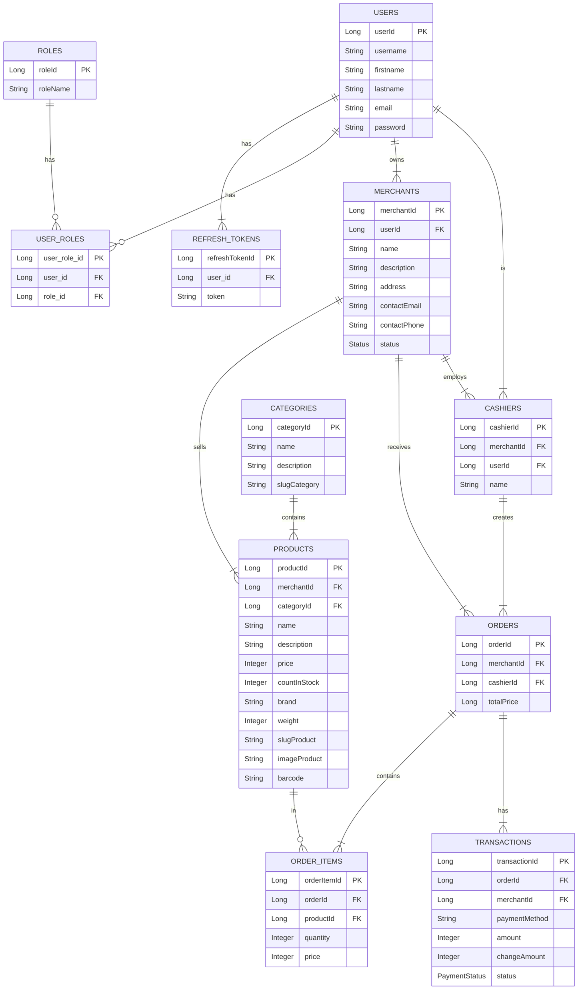

# Spring Boot Point of Sale API

**A Robust Backend API for a Full-Featured Point of Sale (POS) System**

The **Spring Boot Point of Sale API** is a high-performance backend service designed to power a complete retail Point of Sale system. Built using **Java 21** and **Spring Boot**, it delivers a comprehensive set of features including JWT-based authentication, user and role management, product and category handling, order processing, transaction management, and integrated merchant and cashier administration.

---

## Key Features

### Authentication & Security

* **JWT Authentication**: Secure registration and login system using JSON Web Tokens for authentication.
* **Role-Based Access Control (RBAC)**: Fine-grained access control enforcing permissions based on user roles such as admin, merchant, and cashier.

### Product & Category Management

* **Product CRUD Operations**: Full lifecycle management of products including price, stock, brand, weight, barcode, and image support.
* **Category Management**: Structured product categorization using unique slug-based identifiers for efficient lookup and organization.

### Merchant & Cashier Management

* **Merchant Onboarding**: Self-service merchant registration with profile, address, contact details, and business metadata.
* **Cashier Management**: Assignment and administration of cashiers under specific merchant entities.

### Order & Transaction Processing

* **Order Management System**: End-to-end order creation with cashier tracking, merchant association, and automatic total calculation.
* **Transaction Processing**: Payment validation, amount handling, change calculation, and transaction status tracking.

---

## Technology Stack

* **Language**: Java 21
* **Framework**: Spring Boot 3.x
* **Security**: Spring Security with JWT
* **ORM / Data Layer**: Spring Data JPA (Hibernate)
* **Database**: PostgreSQL
* **Build Tool**: Maven
* **API Documentation**: Springdoc OpenAPI (Swagger UI)

---

## Data Architecture & ERD

The database schema is designed to support a scalable retail ecosystem with clear separation between merchants, cashiers, products, and transactions.



---

## API Documentation

The API is fully documented using **Swagger UI**, providing interactive endpoint exploration, request validation, and response schema visualization.

Preview:


---

## Getting Started

### Prerequisites

* Java JDK 21+
* Apache Maven
* PostgreSQL database instance

---

### Installation & Execution

#### 1. Clone Repository

```bash
git clone https://github.com/MamangRust/example-pointofsale-springboot
cd example-pointofsale-springboot
```

#### 2. Configure Database

Update `application.properties`:

```properties
spring.datasource.url=jdbc:postgresql://localhost:5432/pos_db
spring.datasource.username=postgres
spring.datasource.password=postgres
spring.jpa.hibernate.ddl-auto=update
```

#### 3. Run Application

Linux/macOS:

```bash
./mvnw spring-boot:run
```

Windows:

```cmd
mvnw.cmd spring-boot:run
```

#### 4. Access Application

* API Base URL: `http://localhost:8080`
* Swagger UI: `http://localhost:8080/swagger-ui.html`

---

## Source Code

Repository available at:
[https://github.com/MamangRust/example-pointofsale-springboot](https://github.com/MamangRust/example-pointofsale-springboot)
