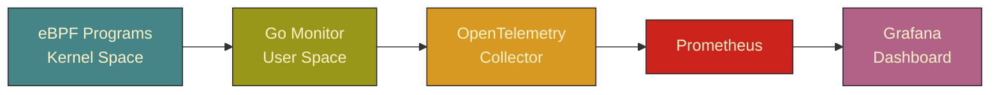

# eBPF Network & DNS Monitoring

A comprehensive network and DNS activity monitoring solution using **eBPF** instrumentation, the **Go** programming language, and a modern observability stack. This system dynamically tracks data traffic and domain resolution at the Linux kernel level to generate real-time analytics with minimal CPU overhead.

---

## Architecture Overview

This project is designed to capture data packets directly at the kernel entry point before they are distributed to user applications, encompassing the following vital components:

* **eBPF Programs**: Low-level (kernel-space) components for efficient and low-overhead data packet monitoring.
* **Go Monitor Application**: A user-space data processing component for handling raw data and distributing metrics.
* **OpenTelemetry**: Standard instrumentation libraries for distributed metric collection and tracing.
* **Prometheus**: A time-series data store for centralized metric storage.
* **Grafana**: A dynamic, graphical dashboard for performance analytics visualization.
* **Jaeger**: A platform for distributed request tracing.



---

## Key Features

* **Real-time DNS Monitoring**: Tracks all DNS resolution queries along with source/destination IP addresses, query types, and Process ID (PID) attribution.
* **Network Traffic Analysis**: Monitors TCP/UDP protocol activity in real-time, accompanied by accumulated byte statistics and process mapping.
* **eBPF Event Processing**: A high-performance kernel ring buffer mechanism to extract anomalous data.
* **Prometheus Metrics Export**: Native integration for exporting monitoring statistical data.
* **Grafana Visual Dashboards**: Equipped with pre-built dashboard templates ready to use for real-time statistical interpretation.
* **Distributed Request Tracing**: Full tracing support integrated with the Jaeger interface.
* **Docker Compose Configuration**: Easy and instant replication of the complete observability infrastructure environment.

---

## Getting Started

### System Prerequisites

* A Linux kernel that supports eBPF features (Version 4.9 or newer).
* Docker & Docker Compose.
* Go version 1.21 or higher (for standalone compilation).
* Clang and LLVM compilers (for compiling eBPF bytecode programs).

### Installation Guide

**1. Clone the Repository and Compile the Code**

```bash
git clone https://github.com/MamangRust/example-monitoringNetworkAndDns-ebpf monitoringnetworkdns
cd monitoringnetworkdns
make install-tools
make build

```

**2. Run the Complete Infrastructure**
Execute the following script to spin up the Go monitoring agent along with the entire observability stack:

```bash
docker-compose up -d

```

**3. Access Service Interfaces**

* **Grafana Dashboard**: `http://localhost:3000` (Default Username/Password: `admin`/`admin`)
* **Prometheus Console**: `http://localhost:9091`
* **Jaeger UI**: `http://localhost:16686`
* **Raw Metrics Endpoint**: `http://localhost:8080/metrics`

---

## Available Core Metrics

### 1. DNS Activity Metrics

* `dns_queries_total`: Total DNS queries based on query type classification and the requester's IP address.
* `dns_monitor_process_active`: The representative number of active process IDs executing DNS resolution calls.

### 2. Network Metrics

* `network_bytes_total`: Total accumulated data volume sent/received based on endpoint IP pairs and protocol types.
* `network_packets_total`: The number of discrete data packets processed by the network system.

### 3. eBPF Internal Metrics

* `ebpf_events_total`: Total accumulated raw data successfully pulled from the kernel ring buffer, classified by PID.

---

## Troubleshooting Guide

* **Permission Denied Issues**: Ensure you execute the user-space monitor program with Administrator (root) privileges, as eBPF programs require privileged access to the `bpf` system call.
```bash
sudo ./bin/monitor

```


* **Kernel Headers Not Found**: Install the kernel development headers corresponding to your OS kernel version.

```bash
  sudo apt-get install linux-headers-$(uname -r)

```

---

## Visual Demo Preview

### eBPF Monitoring Dashboard


---

## Source Code & Repository Links

You can explore the base implementation code for the eBPF ring buffer in C, metrics collection in Go, and the complete visual dashboard setup in the following repository:
[GitHub Repository: example-monitoringNetworkAndDns-ebpf](https://github.com/MamangRust/example-monitoringNetworkAndDns-ebpf)
