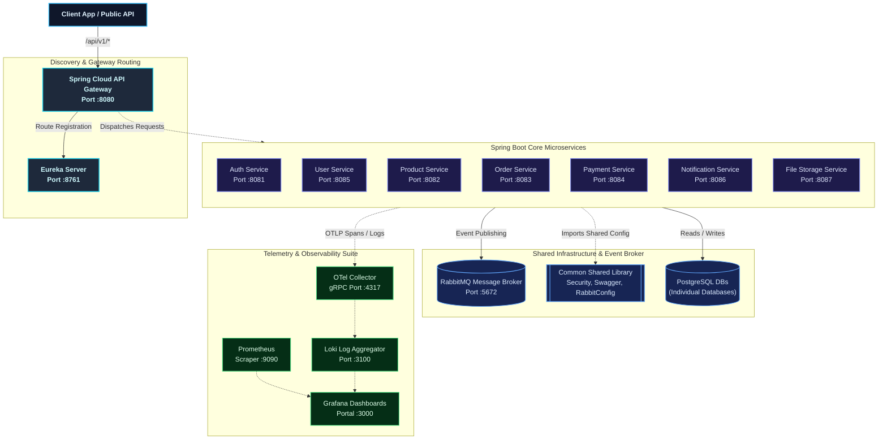
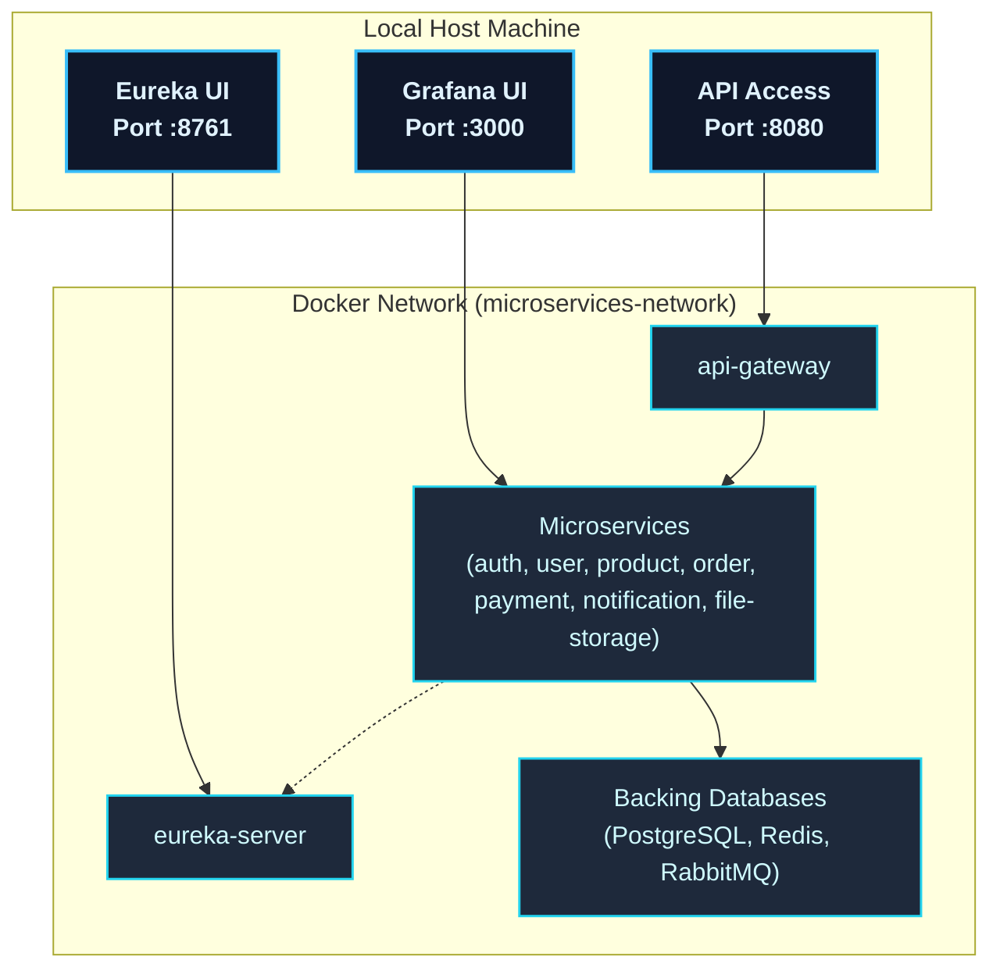
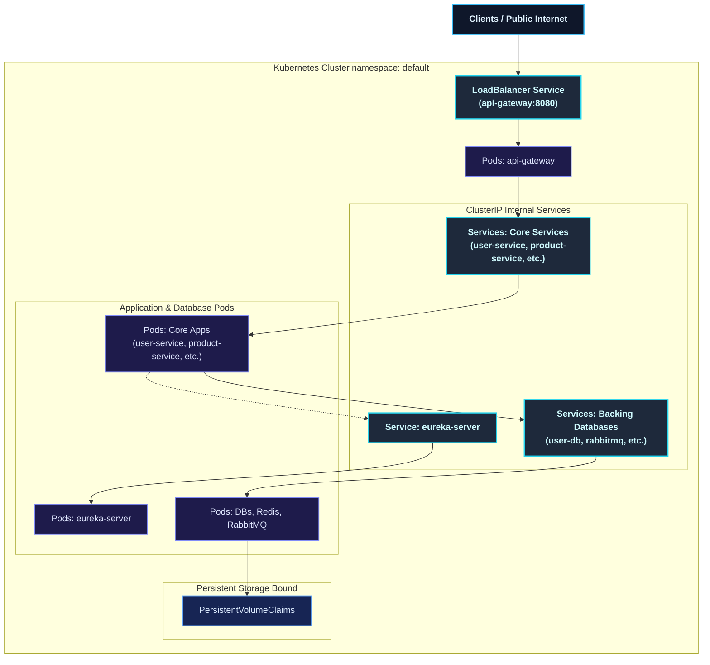

# Spring Boot Observable Microservices Architecture

A production-grade, highly resilient, and fully observable **Spring Boot Microservices platform** built on Spring Cloud, Spring Boot, and Java 21. Enforcing centralized configuration patterns and domain-driven design, this system is optimized for high-performance service registration, intelligent routing, distributed transactions, and advanced inter-service event-driven communication.

The cluster is fully fortified with an **enterprise-grade observability suite** collecting logs, metrics, and traces (OpenTelemetry, Prometheus, Jaeger/Zipkin, Loki, Grafana) orchestrating in harmony under Docker Compose.

---

## System Architecture

The platform consists of specialized microservices decoupled by domain boundaries, sharing a consolidated standard configuration framework:



### Docker Deployment Architecture

In local development and staging environments, the platform relies on **Docker Compose** to provision and orchestrate containers inside a single local host boundary:

*   **Custom Bridge Networking**: All components communicate securely using a private bridge network called `microservices-network`. Core microservices are not exposed to the local host machine except through their designated mapped ports or via the central `api-gateway`.
*   **Persistent Volumes**: Mapped host directories and named Docker volumes preserve PostgreSQL databases data, Redis keys, Loki logs, and Grafana dash configs through container restarts.



### Kubernetes Cluster Architecture

For production and highly-scalable environments, the system is designed to run seamlessly in a **Kubernetes (K8s)** cluster, utilizing orchestrator-native abstractions:

*   **Modular Service Split**: Every individual Spring Boot service has its own independent `Deployment` and `Service` manifest file located in `deployments/kubernetes/` to isolate resource allocations and simplify rolling updates.
*   **Ingress / LoadBalancer Entry**: The `api-gateway` is exposed to external consumers via a **LoadBalancer Service** mapping external traffic directly to gateway pods. Other services are fully isolated behind standard **ClusterIP Services**.
*   **Stateful Storage Bounds**: Relational databases, cache clusters, and message queues utilize **PersistentVolumeClaims (PVC)** mapped to persistent disk storage classes to ensure full state preservation under pod scheduling.



---

## Key Architectural Features & Standardizations

*   **Centralized Infrastructure Library (`common`)**: 
    *   **Dynamic OpenAPI Swagger Configuration**: Uniform documentation dynamically resolved using each application's name. Supported standard JWT Bearer authorization filters.
    *   **Consolidated Security Baseline (`SecurityCommonConfig`)**: Flexible baseline stateless HTTP filters managed using `@ConditionalOnMissingBean` for service overrides.
    *   **Global Event Message Converter**: Unified Jackson JSON messaging framework to guarantee type-safety across queues.
*   **Modular Multi-Stage Build Strategy**: Advanced Docker compilation compiling the shared `common` module inside build layers prior to individual service packagings, eliminating artifact drift.
*   **Feign-driven Microservice Connectivity**:
    *   **`product-service` 🔗 `file-storage-service`**: Product creation/update validates image file metadata existence synchronously via `FileStorageClient`. Dynamic image download URL resolutions `/files/download/{id}` are mapped during outputs.
    *   **`notification-service` 🔗 `file-storage-service`**: Real-time asynchronous file uploaded/deleted event notifications are processed and enriched with real-time metadata (file size, file type, file name).

---

## Port Map Registry

| Application/Service Portal | Address Protocol / Access URL |
| :--- | :--- |
| **API Gateway** | `http://localhost:8080` |
| **Eureka Discovery Server** | [http://localhost:8761](http://localhost:8761) |
| **Auth Service** | `http://localhost:8081` |
| **Product Service** | `http://localhost:8082` |
| **Order Service** | `http://localhost:8083` |
| **Payment Service** | `http://localhost:8084` |
| **User Service** | `http://localhost:8085` |
| **Notification Service** | `http://localhost:8086` |
| **File Storage Service** | `http://localhost:8087` |
| **RabbitMQ Management Dashboard** | [http://localhost:15672](http://localhost:15672) *(guest / guest)* |
| **PostgreSQL Database Engine** | `localhost:5432` |
| **Prometheus Dashboard** | [http://localhost:9090](http://localhost:9090) |
| **Grafana Monitoring Dashboard**| [http://localhost:3000](http://localhost:3000) *(admin / admin)* |
| **OpenTelemetry Collector gRPC**| `localhost:4317` |

---

## Workspace Directory Tree

```
spring-boot-microservices/
├── common/                          # Shared library module (Security, Swagger, RabbitMQ)
├── api-gateway/                     # Spring Cloud API Gateway (Routing & Rate Limiting)
├── eureka-server/                   # Netflix Eureka Service Discovery Registry
├── auth-service/                    # Authentication Service (JWT Generation & Lifecycle)
├── user-service/                    # User Profile Administration Domain
├── product-service/                 # Product Inventory and FileStorage Integration
├── order-service/                   # Orders Management Domain (RabbitMQ Publisher)
├── payment-service/                 # Transactions and Settlement Processing
├── file-storage-service/            # Dedicated Document and Media Storage Domain
├── notification-service/            # Dynamic Email/SMS/Push Notification Dispatcher
├── deployments/                     # Virtualization and Orchestration configs
│   ├── docker/                      #   Docker Compose orchestration stack
│   └── kubernetes/                  #   Fully translated Kubernetes manifests (K8s)
├── docker-compose.yml               # Complete system dependencies virtualization compose
└── README.md                        # Project architecture documentation
```

---

## Getting Started

### Prerequisites
- [JDK 21+](https://adoptium.net/)
- [Maven 3.9+](https://maven.apache.org/)
- [Docker Engine & Compose](https://docs.docker.com/get-docker/)

### 1. Launch Shared Infrastructure
Spin up RabbitMQ, Postgres, Prometheus, Loki, Grafana, and OpenTelemetry Collectors:
```bash
docker compose up -d
```

### 2. Compile and Install Shared Common Library
Before building individual services, install the `common` library module to the local Maven repository:
```bash
mvn clean install -pl common
```

### 3. Build & Run the Microservices Cluster
Compile the workspace and compile the container images:
```bash
docker compose build
```

Boot up the entire microservices cluster:
```bash
docker compose up -d
```

Verify the status of the ecosystem:
```bash
docker compose ps
```

---

## Integration Testing
Verify standard API behaviors by executing the Hurl test suite sequentially:
```bash
hurl --test hurl/*.hurl
```