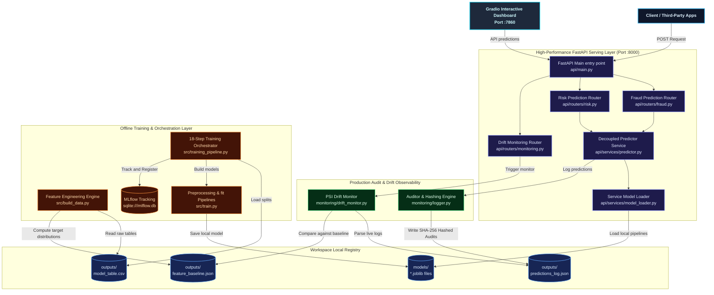
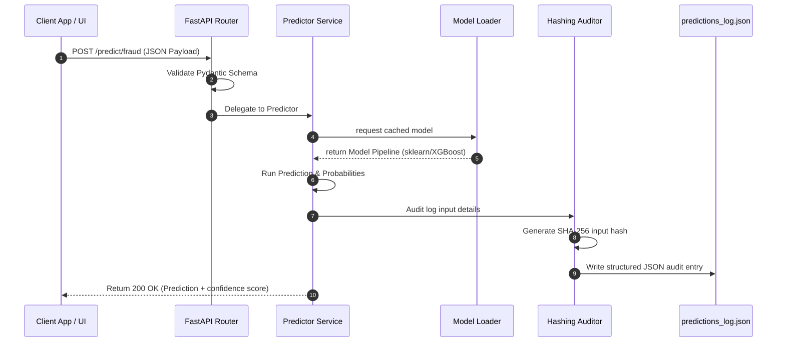
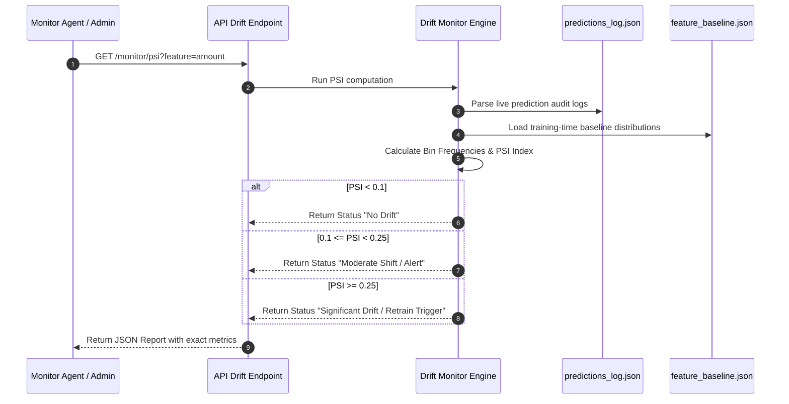

# Production-Ready Fraud Detection Platform - MLOps Architecture

A production-grade, highly modular **MLOps Fraud & Risk Detection Platform** designed as a decoupled monolith. Built in **Python 3.11** using **FastAPI**, **scikit-learn**, and **XGBoost**, the platform implements config-driven machine learning pipelines, automatic MLflow tracking & model registry staging, production audits with SHA-256 input hashing, automated PSI (Population Stability Index) drift monitoring, and a premium interactive dual-tab Gradio UI.

---


## Key Features
*   **Config-Driven Machine Learning**: Centralized config engine (`src/config.py`) orchestrating distinct ML algorithms:
    *   **Fraud Model**: High-performance gradient boosting using **XGBoost Classifier**.
    *   **Risk Model**: Non-linear ensemble categorization using **RandomForest Classifier**.
*   **18-Step Training Orchestration**: Integrated training orchestrator (`src/training_pipeline.py`) handling splits, model fits, automated evaluation, MLflow logging, local serialization, and production stage promotion.
*   **FastAPI Serving Layer**: Decoupled, Pydantic-validated prediction routing utilizing a Service-oriented architecture:
    *   `POST /predict/fraud` with strict request schemas.
    *   `POST /predict/risk` analyzing contextual details and user history.
*   **Realtime Audit Trails**: High-performance auditor (`monitoring/logger.py`) hashing inputs using SHA-256 and serializing requests to a structured JSON audit log.
*   **Automated Drift Monitor**: Population Stability Index (PSI) drift calculation engine (`monitoring/drift_monitor.py`) parsing live production audit logs and comparing them in real-time against training baseline distributions.
*   **Interactive Gradio UI**: Premium frontend interface (`ui/gradio_app.py`) featuring dual interactive tabs for playground testing of the Fraud and Risk models.
*   **DevOps & GitOps Ready**: Unified Docker setups, local-friendly Kubernetes deployments, and a completely self-contained CI testing workflow.

---

## Architecture & Data Flow

The platform is designed around strict separation of concerns, decoupling the **Training Orchestration Layer**, the **API Serving Layer**, the **Monitoring & Drift System**, and the **Interactive UI**.



---

## System Sequence Flows

### 1. High-Performance Prediction & Realtime Auditing
Every prediction request is validated by Pydantic contracts, mapped through isolated service layers, logged with a cryptographic SHA-256 checksum to prevent data tampering, and returned with sub-millisecond latency.



### 2. Live Feature Drift Monitoring (PSI Engine)
The Population Stability Index (PSI) compares live actual inference data against baseline datasets computed during model training. This allows immediate detection of real-world behavior changes (data drift) post-deployment.



---

## Workspace Directory Structure

The repository maintains an elegant, clean, and highly organized production-grade modular design:

```
fraud-detection-mlops/
├── api/                       # fastapi serving application layer
│   ├── main.py                #   fastapi gateway application router
│   ├── routers/               #   isolated API routes (fraud, risk, monitoring)
│   ├── schemas/               #   strict pydantic request schemas
│   └── services/              #   decoupled model loader and predictor services
├── data/                      # database directory
│   └── processed/             #   source raw transaction database files
├── monitoring/                # production logging and analytics layer
│   ├── logger.py              #   cryptographic audit log auditor
│   └── drift_monitor.py       #   population stability index (PSI) drift calculation
├── outputs/                   # engineered datasets and statistical baselines
│   ├── model_table.csv        #   computed master model table features
│   └── feature_baseline.json  #   training-time feature baseline distribution
├── src/                       # config-driven training application layer
│   ├── build_data.py          #   feature engineering and baseline generation engine
│   ├── config.py              #   model configurations dictionary (hyperparameters)
│   ├── evaluate.py            #   Recall, F1, and production staging validations
│   ├── train.py               #   preprocessing and classification pipelines builder
│   ├── training_pipeline.py   #   18-step MLflow orchestrator and register
│   └── utils.py               #   I/O helper utilities, prediction logs and splits
├── ui/                        # interactive interface layer
│   └── gradio_app.py          #   premium dual-tab Gradio blocks dashboard
├── tests/                     # comprehensive testing suite (routes, schemas, models)
├── k8s/                       # local-first kubernetes manifests
├── Dockerfile.api             # API service Dockerfile
├── Dockerfile.gradio          # UI service Dockerfile
├── docker-compose.yml         # local multi-container orchestrator
├── dvc.yaml                   # pipeline stages configuration
├── pytest.ini                 # testing environment configuration
└── requirements.txt           # global python packages listing
```

---

## Getting Started & Execution Guide

Ensure you have **Python 3.11** and **Docker** installed on your system.

### 1. Install Dependencies
```bash
pip install -r requirements.txt
```

### 2. Run Feature Engineering & Seeding
This builds your master feature table and computes the target distributions for the drift baseline:
```bash
python3 -m src.build_data
```

### 3. Run Local Model Training & Registration
Train, evaluate, and stage the scikit-learn models. Using `MLFLOW_TRACKING_URI=sqlite:///mlflow.db` launches a fully self-contained local tracking registry:
```bash
# Train the Fraud Detection XGBoost model
MLFLOW_TRACKING_URI=sqlite:///mlflow.db python3 -m src.training_pipeline --model fraud

# Train the Credit Risk RandomForest model
MLFLOW_TRACKING_URI=sqlite:///mlflow.db python3 -m src.training_pipeline --model risk
```

### 4. Start the FastAPI Serving Layer
Launch the API server with Uvicorn:
```bash
uvicorn api.main:app --host 0.0.0.0 --port 8000
```
*   **Predict Fraud**: `POST http://localhost:8000/predict/fraud`
*   **Predict Risk**: `POST http://localhost:8000/predict/risk`
*   **Drift Report**: `GET http://localhost:8000/monitor/psi`

### 5. Launch the Interactive Gradio UI
Launch the interactive dashboard playground locally:
```bash
python3 ui/gradio_app.py
```
Open your browser at `http://localhost:7860` to access the playground.

### 6. Run Multi-Container Deployments
Spin up both the FastAPI serving app and the Gradio UI dashboard concurrently:
```bash
docker-compose up --build
```

---

## Technical Stack & MLOps Tools

| Domain | Selected Technology | Purpose |
| :--- | :--- | :--- |
| **Languages** | Python 3.11 | Modern, high-performance data engineering and serving. |
| **Model Frameworks** | scikit-learn / XGBoost | Classification algorithms for fraud detection and risk modeling. |
| **Serving Framework** | FastAPI + Uvicorn | High-throughput, asynchronous ASGI REST API gateway. |
| **Experiment Tracking** | MLflow | Experiment parameter tracking, metrics logger, and model registry. |
| **Data Orchestrator** | DVC | Locally reproducible stage caching and ML pipelines. |
| **UI Dashboard** | Gradio (Blocks) | Interactive sandbox interface for real-time model evaluation. |
| **Validation** | Pydantic v2 | Robust request schemas validation. |
| **Testing** | pytest | Automated CI/CD regression, schema, and route validation. |
| **Containerization** | Docker / Compose | Multi-container environment orchestration. |
| **Orchestrator** | Kubernetes | Highly scalable local-friendly deployment manifests. |

---

## Source Code

[View on Github](https://github.com/MamangRust/example-fraud-detection-mlops)

---

<p align="center">
  Built with passion for highly robust, local-first, production-grade MLOps pipelines.
</p>