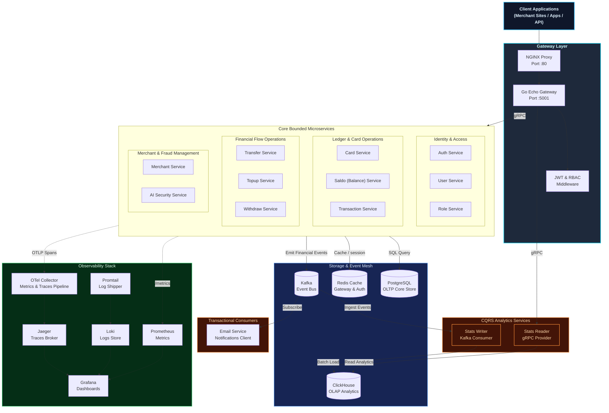
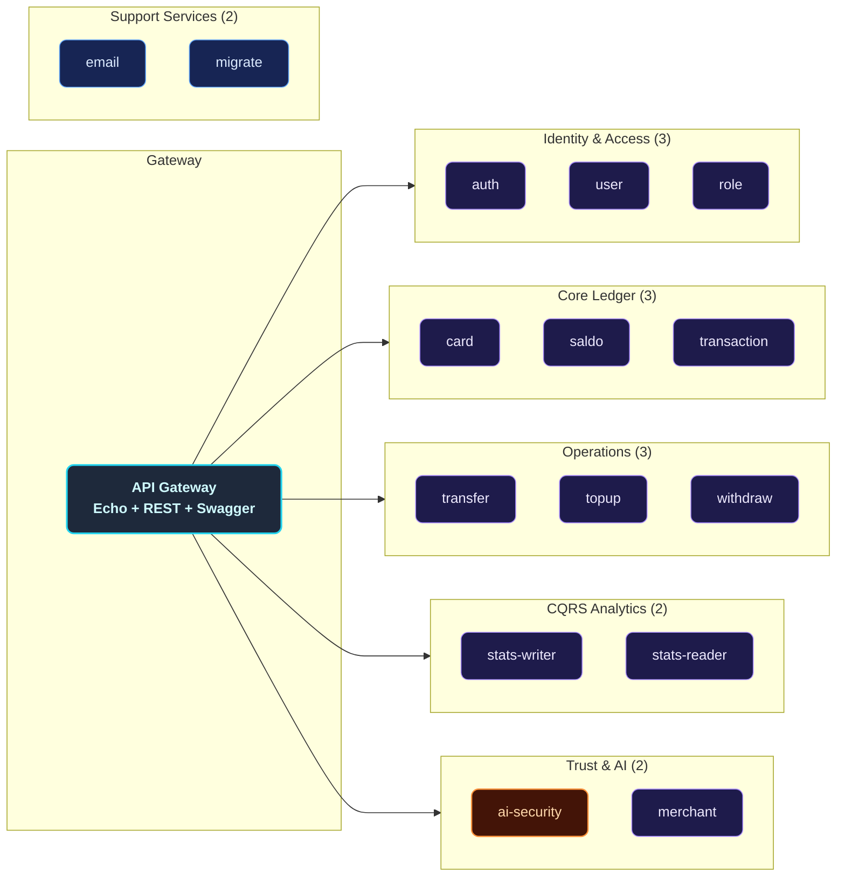
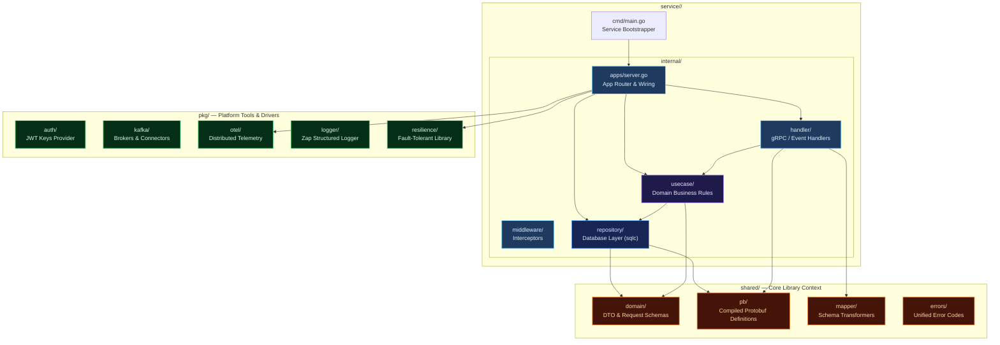
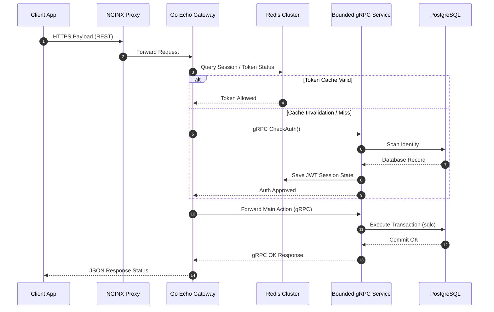
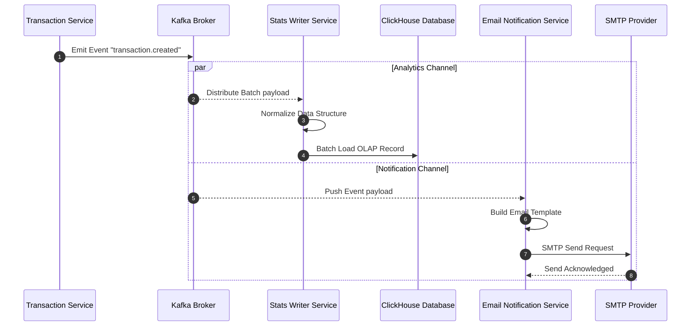
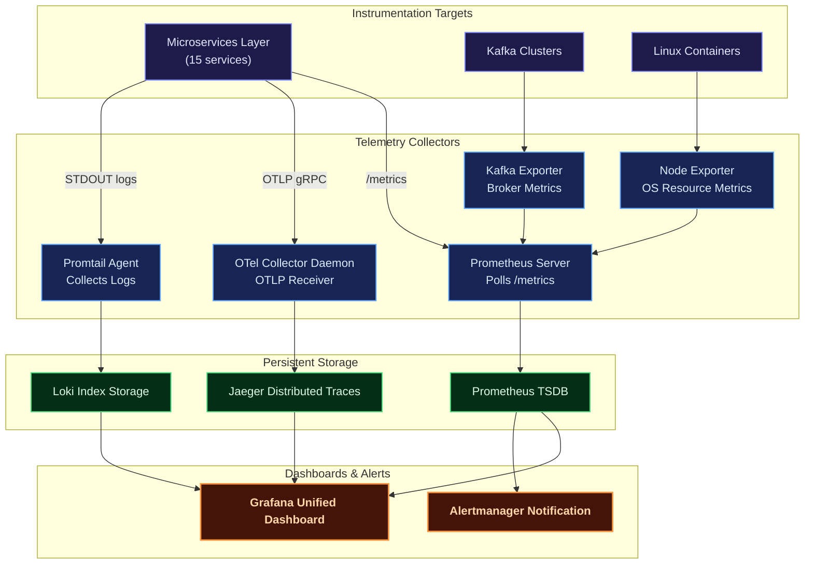
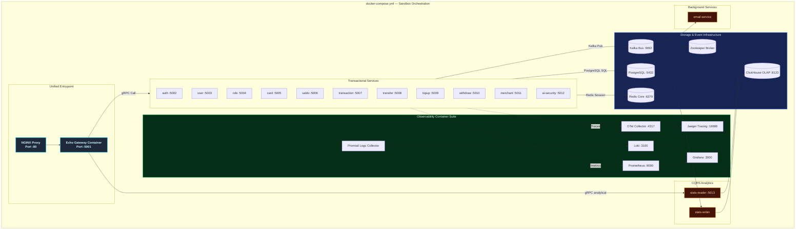
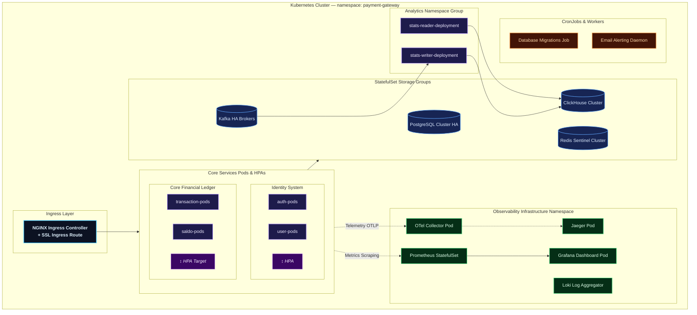

# Distributed Microservice Payment Gateway (gRPC)

A production-grade, **distributed microservice payment gateway backend** built with **Go (Golang)** and **gRPC**, designed to provide an ultra-secure, highly performant financial orchestration platform. The system handles secure transaction flows, multi-tenant merchant onboarding, complex ledger/balance mechanics, and real-time fraud monitoring.

The platform implements a state-of-the-art **CQRS analytics pipeline** with an OLAP database (**ClickHouse**), asynchronous communication via **Kafka** event bus, high-speed authorization caching via **Redis**, and intelligent anomaly checking via a dedicated **AI Security** module. The entire infrastructure is orchestratable via Docker Compose for local environments and production-grade Kubernetes manifests.

---

## Key Features

| Domain | Capabilities |
|--------|-------------|
| **Auth & Identity** | Secure user registration, login, stateless JWT auth with access/refresh tokens, role-based access control (RBAC), and high-speed permission caching via Redis |
| **Card Management** | Full card lifecycle management, registration, activation, and secure validation |
| **Balance & Saldo** | Event-driven balance tracking, consistent ledger management, and safe ledger state propagation |
| **Transaction Engine** | Core payment processing, status state-machine (created, settled, refunded), settlement flows, and instant verification pipelines |
| **Financial Operations** | Peer-to-peer transfers, merchant payouts, external bank/wallet top-ups, withdrawal requests, and transaction ledger logging |
| **Merchant Services** | Onboarding processes, verification documents, and automated merchant settlements |
| **AI Security** | Real-time AI-based anomaly detection, fraud analysis, and security risk assessment |
| **CQRS Analytics** | Asynchronous events ingestion via `stats-writer` (Kafka to ClickHouse) and 125+ sub-second analytical procedures via `stats-reader` (gRPC) |
| **Notifications** | Event-triggered transactional confirmation emails for payments, top-ups, transfers, and withdraws |
| **Observability** | Metrics (Prometheus + Grafana), Logging (Loki + Promtail), Tracing (Jaeger + OpenTelemetry), System metrics (Node Exporter), Kafka metrics (Kafka Exporter) |
| **Deployment** | Docker Compose for local dev, Kubernetes manifests with HPA for production |

---

## Architecture Overview

The platform is designed around strict microservice boundaries. The external proxy (**NGINX**) routes external traffic, terminating SSL/TLS, and forwards requests to the internal **Go API Gateway (Echo)**. The gateway authenticates requests, checks Redis cache, and invokes downstream microservices via high-performance **gRPC** protocols. Asynchronous background workloads, financial analytics, and notifications are fully decoupled using **Apache Kafka** event streaming.

### Core Architecture Principles

- **Single Responsibility**: Each service operates in its own bounded context with its own database access schema.
- **CQRS Pattern**: Transactional pathways (OLTP PostgreSQL) are strictly separated from high-throughput reporting queries (OLAP ClickHouse).
- **Clean Architecture & Domain Driven Design**: Services follow a strict `handler -> usecase -> repository` layer hierarchy with complete dependency injection.
- **Observability-First**: Telemetry spans, metrics, and structured logs are propagated across service boundaries via OpenTelemetry context injection.
- **Fault Tolerance**: Critical transactional routes are wrapped in circuit breakers and rate limiters.



---

## Service Catalog

The payment gateway consists of **15 specialized backend services** working in absolute coordination:



---

## Internal Service Architecture

Every microservice matches the **Clean Architecture** patterns defined by domain isolation, separating business rules from infrastructure boundaries.



---

## Data & Event Flow

### Synchronous Flow (gRPC & Caching)

All client-initiated actions go through the external reverse-proxy and the internal gateway, executing high-speed lookups and gRPC operations.



### Asynchronous Flow (Kafka Events & CQRS Ingestion)

When core services successfully commit transactions, events are distributed to the event mesh for downstream notification delivery and OLAP ingestion.



---

## Observability Architecture

Observability is a core pillar of the payment gateway, tracking every financial request from gateway to analytical database with microsecond precision.



| Pillar | Tooling Stack | Core Mission |
|--------|---------------|--------------|
| **Metrics** | Prometheus + Grafana | Live visualization of API latency (p95, p99), error ratios, database pool states, Kafka topic lags |
| **Structured Logging** | Loki + Promtail | Centralized JSON logging context searchable via LogQL directly linked with trace identifiers |
| **Distributed Tracing** | Jaeger + OpenTelemetry | Complete end-to-end tracing showing latency graphs of sequential microservice calls |
| **Infrastructure Stats** | Node Exporter + Kafka Exporter | Host capacity parameters tracking CPU, I/O limits, network packet distributions, and cluster stats |

---

## Deployment Architectures

### Docker Compose (Local Development & Tests)

The Docker Compose orchestration configuration builds and integrates all services and supporting network infrastructure dynamically.



### Kubernetes Topology (Production Deployment Model)

Production topology utilizes separated namespaces, dedicated StatefulSets for database clusters, and Horizontal Pod Autoscaling (HPA) targets based on load patterns.



---

## Technology Stack

| Category | Technology | Purpose |
|----------|-----------|---------|
| **Core Language** | Go (Golang) | Ultra-fast execution time, low memory usage |
| **Security Scripting** | Python | Model integration for AI Anomaly analysis |
| **API Web Engine** | Echo | High-performance Go web gateway wrapper |
| **Internal RPC** | gRPC + Protobuf | Statically typed, high-performance inter-process API |
| **Core Database (OLTP)** | PostgreSQL | Strict transaction consistency and ACID properties |
| **Analytics Store (OLAP)**| ClickHouse | Columnar data representation for microsecond reporting |
| **In-Memory Caching** | Redis | Rate limit indexes and secure authentication sessions |
| **Message Broker** | Apache Kafka | Highly performant event streaming and decoupling |
| **SQL Compiler** | sqlc | Automated mapping of strict SQL schemas into type-safe Go structs |
| **Schema Migration** | Goose | Incremental database schema versioning tool |
| **Traces Collectors** | Jaeger + OpenTelemetry | Unified platform tracing visualization |
| **Metrics Collector** | Prometheus | Native system metrics parsing and alerting |
| **Log Processing** | Loki + Promtail | High-volume log shipper and visualization engine |
| **Visualization UI** | Grafana | Universal single window for metrics, traces, and logs |
| **API Gateway Proxy** | NGINX | Central reverse-proxy, rate limiter, and security shield |
| **Container Engine** | Docker & Compose | Local system modeling and image isolation |
| **Deployment Engine** | Kubernetes | High availability pod scheduler and orchestration |

---

## Getting Started

### Prerequisites

Verify the presence of following tools in the shell:

- Git
- Go (v1.20+)
- Docker & Compose
- Make command tools
- Protobuf Compiler (protoc)

### 1. Clone the Repository

```sh
git clone https://github.com/MamangRust/microservice-payment-gateway-grpc.git
cd microservice-payment-gateway-grpc
```

### 2. Prepare Environment Configurations

Setup core configuration variables for service components:

```sh
# Root application configuration
cp .env.example .env

# Local container sandbox configuration environment
cp deployments/local/docker.env.example deployments/local/docker.env
```

### 3. Launch Development Infrastructure

Build the backend Docker container images and boot core dependencies:

```sh
# Compiles localized binaries and spins containers up
make build-up

# Appends transactional schemas to PostgreSQL
make migrate

# Injects sandbox mock statistics data
make seeder
```

Verify service network properties using `make ps`.

### 4. Interactive Dashboard Links

| Tooling / Console | Access Point Address |
|-------------------|----------------------|
| **API Gateway REST** | `http://localhost:80` |
| **Swagger Documentations** | `http://localhost:5001/swagger/index.html` |
| **Grafana Dashboard Portal** | `http://localhost:3000` |
| **Jaeger Trace Viewer** | `http://localhost:16686` |
| **Prometheus Interface** | `http://localhost:9090` |

---

## Makefile / Justfile Commands

| Shell Command | Execution Function |
|---------------|-------------------|
| `make build-up` | Recompiles altered services and brings the whole Docker Compose stack up |
| `make up` | Starts all system container units from cached image binaries |
| `make down` | Halts container operations and unbinds internal local networks |
| `make ps` | Displays the status details of all active sandbox container pods |
| `make migrate` | Applies transactional database schema transitions |
| `make migrate-down` | Rolls database schemas back to the previous version |
| `make seeder` | Populates core datasets with dummy financial configurations |
| `make generate-proto` | Compiles Protobuf definition schemas into Go modules |
| `make generate-sql` | Re-compiles SQL structures via sqlc compilers |
| `make generate-swagger` | Regenerates local Swagger documentation payloads |
| `make kube-start` | Boots local sandbox Kubernetes cluster nodes (Minikube) |
| `make kube-up` | Deploys active gateway configurations and services to Kubernetes namespaces |
| `make kube-down` | Destroys running deployment objects inside active Kubernetes namespaces |
| `make kube-status` | Lists all active pods, deployments, and stateful sets in the cluster |

---

## Source Code

[View on GitHub](https://github.com/MamangRust/microservice-payment-gateway-grpc)

Built with Go, gRPC, and a passion for clean, scalable, high-performance financial systems.
