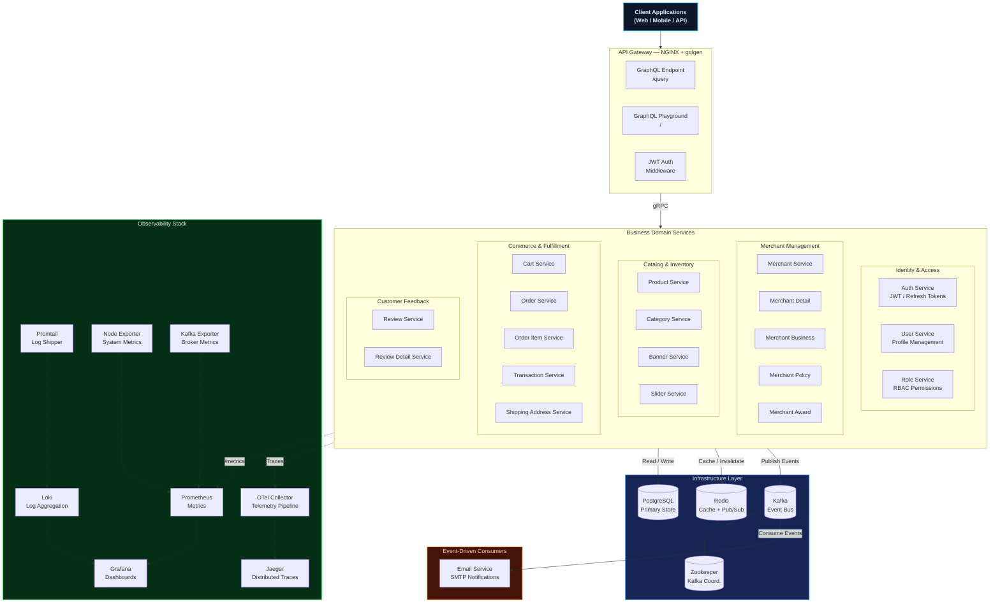
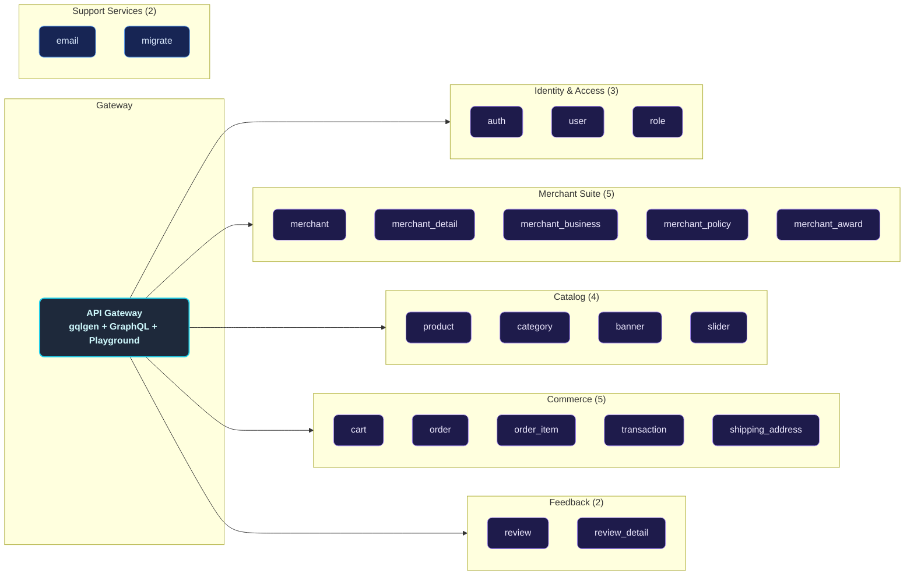
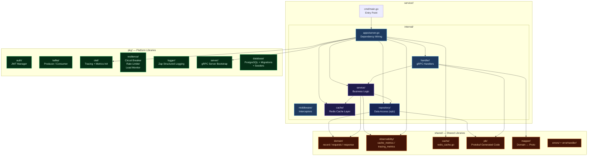
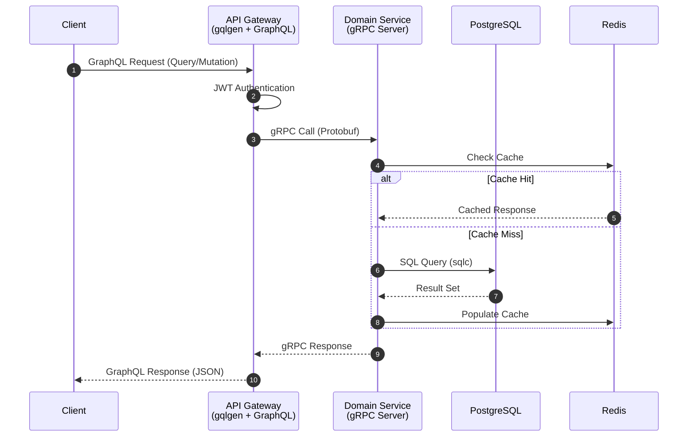
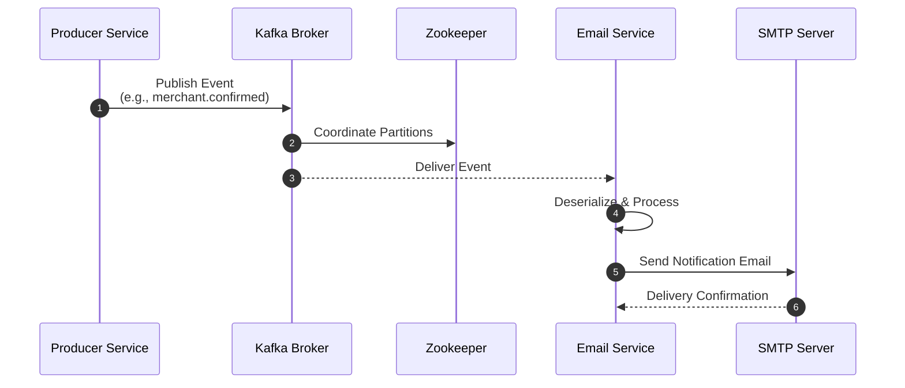
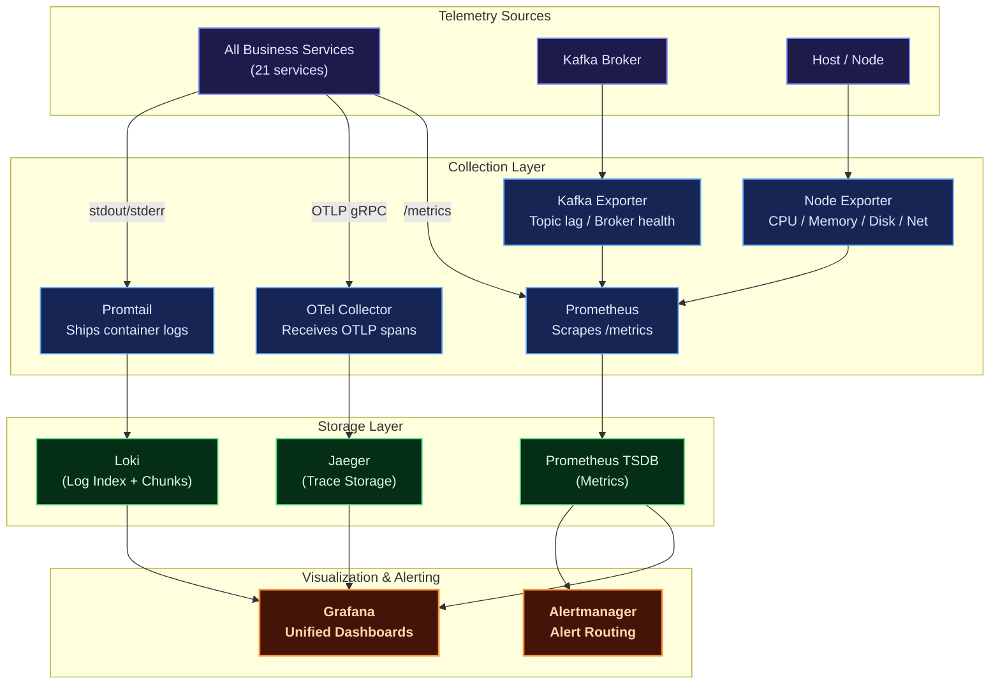
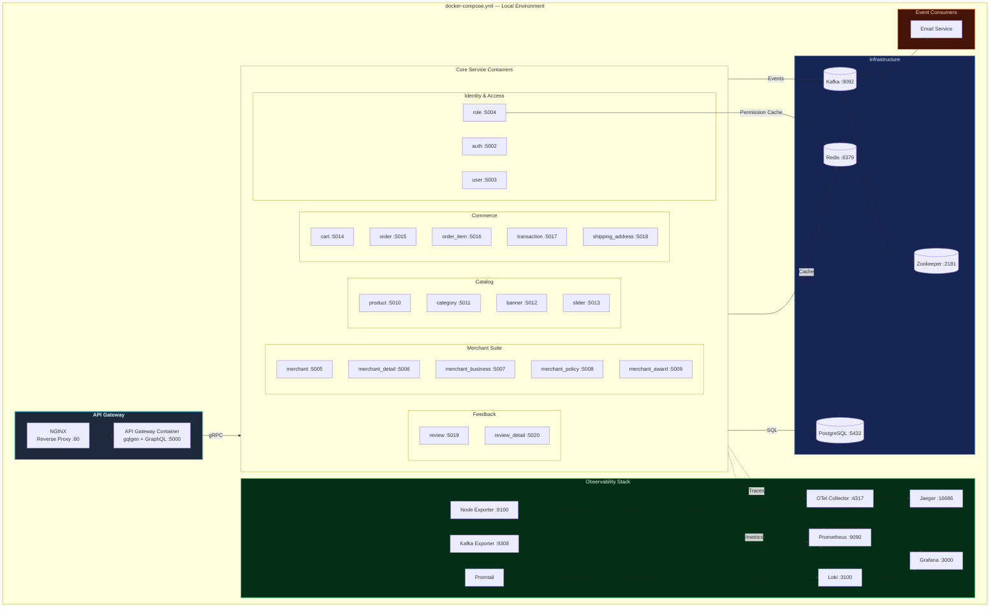
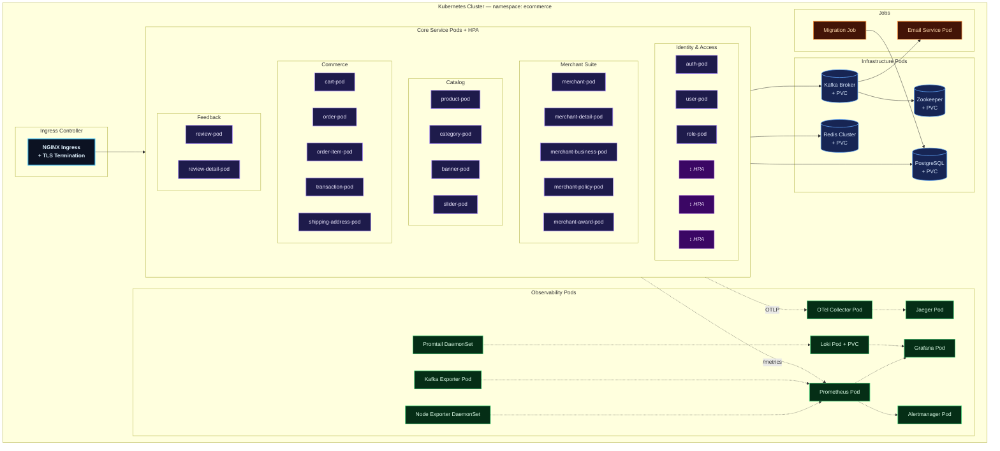

# Distributed Modular Monolith E-commerce

A production-grade, **modular-monolith e-commerce backend** built with **Go (Golang)**, designed around domain-driven service boundaries while retaining the operational simplicity of a single deployment unit. Each business domain — Users, Merchants, Products, Orders, Transactions, Reviews — lives in its own self-contained module with a clean internal architecture, yet all modules ship as independently deployable containers that communicate via **gRPC** and asynchronous **Kafka** events.

The platform ships with a **full observability stack** (Prometheus, Grafana, Loki, Jaeger, OpenTelemetry), **Redis caching** with instrumented metrics, **circuit-breaker & rate-limiting** resilience patterns, and first-class **Kubernetes** manifests featuring Horizontal Pod Autoscalers (HPA) for every service.

---

## Key Features

| Domain | Capabilities |
|--------|-------------|
| **Auth & Users** | Registration, login, JWT access/refresh tokens, role-based authorization (RBAC), password reset flows |
| **Merchants** | Merchant onboarding, business details, verification documents, social links, policies, awards |
| **Products & Inventory** | Full CRUD for products & categories, stock tracking, pricing, rich descriptions |
| **Cart & Orders** | Add-to-cart, checkout, order lifecycle management, order-item decomposition |
| **Transactions** | Payment recording, status tracking, event-driven confirmation pipelines |
| **Reviews** | Product ratings & detailed review submissions post-purchase |
| **Notifications** | Kafka-driven email service for merchant confirmations, account verification, password resets, transaction updates |
| **Observability** | Metrics (Prometheus + Grafana), Logging (Loki + Promtail), Tracing (Jaeger + OpenTelemetry), System metrics (Node Exporter), Kafka metrics (Kafka Exporter) |
| **Deployment** | Docker Compose for local dev, Kubernetes manifests with HPA for production |

---

## Architecture Overview

The platform follows a **Distributed Modular Monolith** architecture — each module is a self-contained Go binary with its own clean-architecture internals, deployed as an independent container. An **API Gateway** (NGINX + gqlgen) provides a unified **GraphQL** entry point, translating GraphQL queries and mutations into gRPC calls to downstream services.

### Core Architecture Principles

- **Single Responsibility**: Each service owns its domain logic, data access, and caching layer
- **Clean Architecture**: Every service follows `handler → service → repository` with clear dependency injection
- **Event-Driven Decoupling**: Kafka enables asynchronous communication without direct service dependencies
- **Observability-First**: Every service is instrumented with OpenTelemetry traces, Prometheus metrics, and structured logging
- **Resilience Patterns**: Built-in circuit breakers, request rate limiters, and load monitors in the shared `pkg/resilience` package



---

## Service Catalog

The platform is composed of **21 independently deployable services** plus supporting infrastructure:



---

## Internal Service Architecture

Every business service follows a **Clean Architecture** pattern with strict layering. Dependencies flow inward, keeping the core business logic free from infrastructure concerns.



---

## Data & Event Flow

### Synchronous Flow (gRPC)

All client-facing requests flow through the API Gateway, which forwards them over gRPC to the appropriate domain service.



### Asynchronous Flow (Kafka Events)

Services publish domain events to Kafka topics. Downstream consumers (e.g., Email Service) react to these events without coupling to the producer.



---

## Observability Architecture

The platform implements all **Three Pillars of Observability** — Metrics, Logs, and Traces — with a unified visualization layer.



| Pillar | Tool | Purpose |
|--------|------|---------|
| **Metrics** | Prometheus + Grafana | Request rates, error rates, latency percentiles, cache hit ratios, system resource utilization |
| **Logging** | Loki + Promtail | Structured JSON logs from all services, queryable via LogQL in Grafana |
| **Tracing** | Jaeger + OpenTelemetry | End-to-end distributed trace visualization, latency breakdown per service hop |
| **Alerting** | Alertmanager | Alert routing and notification for metric threshold breaches |

---

## Deployment Architectures

### Docker Compose (Local Development)

The Docker Compose setup provides a complete local development environment with all services, databases, message brokers, and observability tools orchestrated in a single command.



### Kubernetes (Production)

The Kubernetes deployment provides a production-ready, scalable, and resilient environment. Every service has its own **Deployment**, **Service**, and **HPA** manifests under `deployments/kubernetes/`.



---

## Technology Stack

| Category | Technology | Purpose |
|----------|-----------|---------|
| **Language** | Go (Golang) | High-performance, statically typed backend |
| **API Framework** | gqlgen | GraphQL API Gateway framework |
| **RPC** | gRPC + Protobuf | High-performance inter-service communication |
| **Database** | PostgreSQL | Primary relational data store |
| **SQL Codegen** | sqlc | Type-safe SQL → Go code generation |
| **Migrations** | Goose | Database schema migration management |
| **Caching** | Redis | In-memory cache with instrumented metrics |
| **Messaging** | Apache Kafka | Asynchronous event-driven communication |
| **Coordination** | Zookeeper | Kafka cluster coordination |
| **Auth** | JWT | Stateless authentication & authorization |
| **Logging** | Zap | High-performance structured logging |
| **Metrics** | Prometheus | Metric collection & alerting rules |
| **Tracing** | Jaeger + OpenTelemetry | Distributed trace collection & visualization |
| **Log Aggregation** | Loki + Promtail | Centralized log storage & shipping |
| **Dashboards** | Grafana | Unified metric, log, and trace visualization |
| **Alerting** | Alertmanager | Alert routing & notification dispatch |
| **System Metrics** | Node Exporter | Host-level CPU / Memory / Disk / Network metrics |
| **Kafka Metrics** | Kafka Exporter | Broker health, topic lag, consumer group metrics |
| **Telemetry Pipeline** | OTel Collector | Vendor-agnostic telemetry receive, process, export |
| **Reverse Proxy** | NGINX | API routing, load balancing, TLS termination |
| **Containerization** | Docker + Docker Compose | Container image building & local orchestration |
| **Orchestration** | Kubernetes | Production-grade container orchestration with HPA |
| **API Docs** | GraphQL Playground | Built-in interactive GraphQL IDE & schema documentation |
| **Resilience** | Circuit Breaker, Rate Limiter, Load Monitor | Built-in fault tolerance patterns (`pkg/resilience`) |

---

## Getting Started

### Prerequisites

Ensure the following tools are installed on your system:

- [Git](https://git-scm.com/)
- [Go](https://go.dev/) (v1.20+)
- [Docker](https://www.docker.com/) & [Docker Compose](https://docs.docker.com/compose/)
- [Make](https://www.gnu.org/software/make/) or [Just](https://github.com/casey/just) (task runner)
- [Protobuf Compiler](https://grpc.io/docs/protoc-installation/) (for proto generation)

### 1. Clone the Repository

```sh
git clone https://github.com/MamangRust/monolith-graphql-ecommerce.git
cd monolith-graphql-ecommerce
```

### 2. Configure Environment

Create the required environment files:

```sh
# Root-level configuration
cp .env.example .env

# Docker-specific overrides
cp deployments/local/docker.env.example deployments/local/docker.env
```

Edit the `.env` and `docker.env` files to match your local setup (database credentials, Kafka brokers, Redis addresses, etc.).

### 3. Build & Launch (Docker Compose)

```sh
# Build all service images and start the full stack
make build-up

# Run database migrations
make migrate

# (Optional) Seed the database with sample data
make seeder
```

The platform is now fully operational. Verify with:

```sh
make ps
```

### 4. Access Services

| Service | URL |
|---------|-----|
| GraphQL Playground (via Nginx) | `http://localhost:80` |
| GraphQL Endpoint (via Nginx) | `http://localhost:80/query` |
| GraphQL Playground (Direct) | `http://localhost:5000` |
| GraphQL Endpoint (Direct) | `http://localhost:5000/query` |
| Grafana Dashboards | `http://localhost:3000` |
| Prometheus | `http://localhost:9090` |
| Jaeger UI | `http://localhost:16686` |
| Loki (via Grafana) | `http://localhost:3000` → Explore → Loki |

### Stopping the Platform

```sh
make down
```

---

## Makefile / Justfile Commands

The project provides both a `Makefile` and a `justfile` with equivalent commands:

| Command | Description |
|---------|-------------|
| `make build-up` | Build all Docker images and start the entire stack |
| `make up` | Start all services (images must already be built) |
| `make down` | Stop and remove all running containers |
| `make ps` | Show status of all running containers |
| `make migrate` | Run database schema migrations (up) |
| `make migrate-down` | Rollback database migrations |
| `make seeder` | Seed the database with sample data |
| `make generate-proto` | Regenerate Go code from `.proto` definitions |
| `make generate-sql` | Regenerate Go code from SQL queries (sqlc) |
| `just generate-graphql` | Regenerate GraphQL resolvers and server code (gqlgen) |
| `make build-image` | Build Docker images for all services |
| `make image-load` | Load Docker images into Minikube |
| `make image-delete` | Delete Docker images from Minikube |
| `make kube-start` | Start Minikube cluster |
| `make kube-up` | Deploy all services to Kubernetes |
| `make kube-down` | Tear down all Kubernetes deployments |
| `make kube-status` | Show status of Pods, Services, PVCs, Jobs |
| `make kube-tunnel` | Create tunnel to Minikube for external access |
| `make test-auth` | Run tests for the `auth` service |

---

## Project Structure

```
monolith-graphql-ecommerce/
├── proto/                          # Protobuf definitions (22 domains)
├── shared/                         # Shared Go module
│   ├── pb/                         #   Generated protobuf Go code
│   ├── domain/                     #   Domain models (record/request/response)
│   ├── mapper/                     #   Domain ↔ Protobuf mappers
│   ├── cache/                      #   Redis cache abstraction
│   ├── observability/              #   Cache metrics + tracing metrics
│   ├── errors/                     #   Custom error types
│   └── errorhandler/               #   Error handling utilities
├── pkg/                            # Platform-level Go module
│   ├── auth/                       #   JWT token manager
│   ├── database/                   #   PostgreSQL connection + migrations + seeders
│   ├── kafka/                      #   Kafka producer/consumer wrapper
│   ├── otel/                       #   OpenTelemetry initialization
│   ├── resilience/                 #   Circuit breaker, rate limiter, load monitor
│   ├── logger/                     #   Zap structured logger
│   ├── server/                     #   gRPC server bootstrap
│   ├── middleware/                 #   Shared middleware
│   ├── email/                      #   Email client
│   ├── hash/                       #   Password hashing
│   ├── dotenv/                     #   Environment loader
│   ├── upload_image/               #   Image upload handler
│   ├── randomstring/               #   Random string generator
│   ├── trace_unic/                 #   Trace ID utilities
│   └── utils/                      #   General utilities
├── service/                        # All microservices
│   ├── apigateway/                 #   GraphQL API Gateway (gqlgen + Playground)
│   ├── auth/                       #   Authentication service
│   ├── user/                       #   User management
│   ├── role/                       #   RBAC role management
│   ├── merchant/                   #   Merchant core
│   ├── merchant_detail/            #   Merchant details
│   ├── merchant_business/          #   Merchant business info
│   ├── merchant_policy/            #   Merchant policies
│   ├── merchant_award/             #   Merchant awards
│   ├── product/                    #   Product management
│   ├── category/                   #   Category management
│   ├── cart/                       #   Shopping cart
│   ├── order/                      #   Order management
│   ├── order_item/                 #   Order item decomposition
│   ├── transaction/                #   Payment/transaction processing
│   ├── review/                     #   Product reviews
│   ├── review_detail/              #   Review details
│   ├── shipping_address/           #   Shipping address management
│   ├── banner/                     #   Banner management
│   ├── slider/                     #   Slider/carousel management
│   ├── email/                      #   Email notification consumer
│   ├── migrate/                    #   Database migration runner
│   └── seeder/                     #   Database seeder
├── deployments/
│   ├── local/                      #   Docker Compose configuration
│   └── kubernetes/                 #   K8s manifests (111 files)
├── observability/                  #   Prometheus, Loki, OTel, Promtail configs
├── grafana/                        #   Grafana dashboard provisioning
├── nginx/                          #   NGINX reverse proxy configuration
├── redis/                          #   Redis configuration
└── images/                         #   Documentation screenshots
```
---


## Source Code
[View on GitHub](https://github.com/MamangRust/monolith-graphql-ecommerce)

---

<p align="center">
  Built with Go, gRPC, and a passion for clean architecture.
</p>