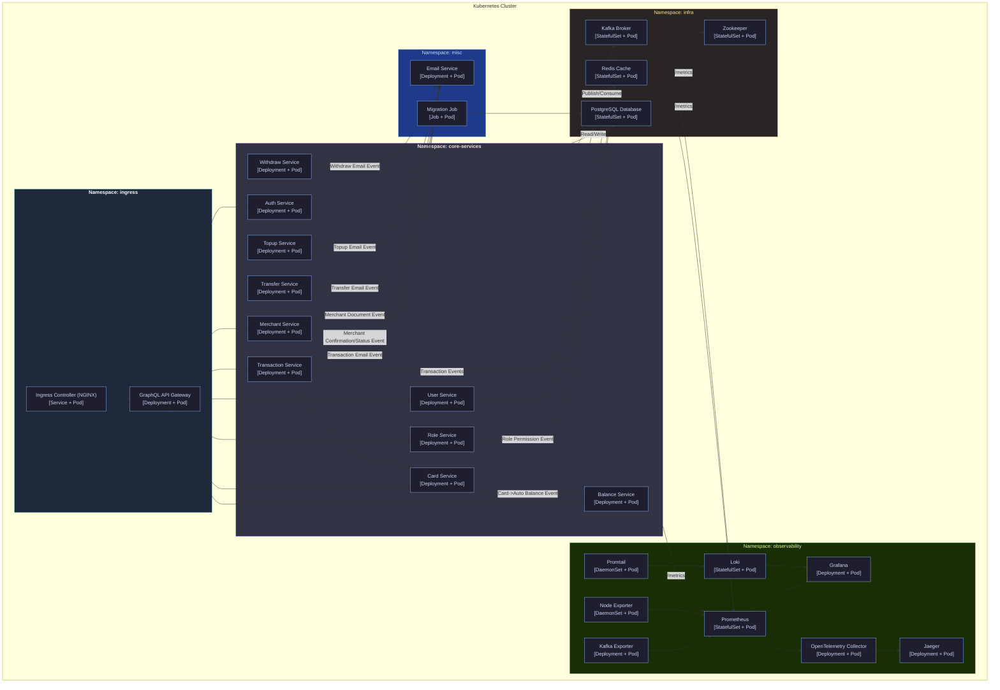

# Distributed Modular Monolith Payment Gateway

Proyek ini adalah **Implementasi Distributed Modular Monolith Payment Gateway** dari **Sistem Gerbang Pembayaran**. Arsitektur ini dirancang untuk menyediakan **backend yang aman, dapat diskalakan, dan modular** untuk menangani transaksi keuangan, pembayaran merchant, operasi kartu, dan alur penyelesaian.

Tidak seperti monolit tradisional, sistem ini disusun menjadi **modul (layanan) yang terdefinisi dengan baik** seperti Auth, Pengguna, Peran, Kartu, Saldo, Transaksi, Merchant, Transfer, Isi Ulang, Tarik Tunai, dll. Setiap modul berkomunikasi secara internal melalui **gRPC** dan secara eksternal melalui **GraphQL API Gateway**. Peristiwa dipublikasikan melalui **Kafka** untuk alur kerja asinkron yang digerakkan oleh peristiwa (misalnya, penyelesaian, notifikasi email, pembaruan saldo).

Di lapisan infrastruktur, sistem terintegrasi dengan:

- **PostgreSQL** sebagai basis data relasional inti.
- **Redis** untuk caching dan manajemen sesi waktu nyata.
- **Kafka** (dengan Zookeeper) sebagai bus acara untuk pemrosesan asinkron.
- **Layanan Email** untuk mengirim konfirmasi, penyelesaian, dan notifikasi transaksional.
- **Tumpukan Observabilitas** (Prometheus, Grafana, Loki, Jaeger, OpenTelemetry) untuk pemantauan, pencatatan, dan pelacakan di seluruh ekosistem.

Penerapan dapat dijalankan di:

- **Docker Compose** untuk pengembangan dan pengujian lokal yang lengkap.
- **Kubernetes** untuk lingkungan tingkat produksi dengan penskalaan otomatis dan ketahanan.

---

## Fitur Utama

- **Manajemen Otentikasi & Peran**
  - Otentikasi pengguna yang aman dengan JWT.
  - Kontrol akses berbasis peran (admin, merchant, pelanggan, sistem).
  - Izin disimpan di Redis untuk pencarian cepat.

- **Manajemen Kartu & Saldo**
  - Pendaftaran kartu dan manajemen siklus hidup.
  - Pembaruan saldo otomatis yang dipicu oleh peristiwa kartu.
  - Layanan saldo memastikan status akun yang konsisten.

- **Pemrosesan Transaksi**
  - Dukungan penuh untuk transaksi pembayaran, termasuk pembuatan, penyelesaian, pengembalian dana.
  - Peristiwa transaksi dipublikasikan ke Kafka untuk layanan hilir.
  - Konfirmasi transaksi waktu nyata dikirim melalui email.

- **Transfer, Isi Ulang, dan Penarikan**
  - Layanan transfer untuk pembayaran peer-to-peer atau merchant.
  - Layanan isi ulang untuk mendanai kartu atau dompet.
  - Layanan penarikan untuk pembayaran kepada merchant atau pelanggan.
  - Setiap operasi menghasilkan konfirmasi email berbasis peristiwa.

- **Manajemen Merchant**
  - Pendaftaran dan verifikasi merchant.
  - Status dokumen dan peristiwa konfirmasi terintegrasi dengan Layanan Email.
  - Alur penyelesaian terhubung ke layanan Transaksi dan Saldo.

- **Arsitektur Berbasis Peristiwa**
  - Broker Kafka memastikan pemisahan antara modul inti.
  - Notifikasi email, pemicu penyelesaian, dan pembaruan saldo digerakkan oleh peristiwa.
  - Cache Redis menyimpan data yang sering diakses (izin, sesi, saldo).

- **Observabilitas & Pemantauan**
  - Endpoint `/metrics` di semua layanan diekspos ke Prometheus.
  - Log dikirim dengan Promtail -> Loki.
  - Kesehatan sistem divisualisasikan melalui dasbor Grafana.
  - Pelacakan ujung ke ujung dengan OpenTelemetry -> Jaeger.

---

## Arsitektur Penerapan

### 1. Docker Compose (Pengembangan Lokal)
- Mengatur **GraphQL API Gateway, Layanan Inti, Pesan (Kafka + Zookeeper), Basis Data (PostgreSQL), Redis, Layanan Email, dan tumpukan Observabilitas**.
- Ideal untuk **pengujian integrasi** dan menjalankan sistem gerbang pembayaran penuh secara lokal.
- Pengembang dapat memvalidasi alur transaksi ujung ke ujung (misalnya, kartu -> saldo -> transaksi -> email).

### 2. Kubernetes (Produksi)
- Setiap layanan inti berjalan di Pod-nya sendiri di dalam kluster.
- Kafka, Redis, PostgreSQL diterapkan sebagai Pod infrastruktur yang tangguh.
- Tugas migrasi memastikan skema basis data selalu terbaru.
- Horizontal Pod Autoscalers (HPA) menskalakan layanan penting seperti **Transaksi**, **Saldo**, atau **Merchant** di bawah beban.
- Komponen observabilitas diterapkan sebagai Pod/DaemonSet untuk **log, metrik, dan jejak**.
- Alur yang digerakkan oleh peristiwa tetap terpisah, memastikan **throughput tinggi dan toleransi kesalahan** dalam operasi keuangan.

---

## Teknologi yang Digunakan

- **GraphQL API Gateway** — Titik masuk tunggal untuk seluruh sistem. Menggabungkan data dari berbagai microservice (via gRPC) dan menyajikannya dalam bentuk GraphQL schema.
- **net/http** — Digunakan untuk menangani permintaan HTTP GraphQL tanpa framework tambahan (lebih ringan dibanding Echo).
- **Zap Logger** — Logging terstruktur untuk gateway.
- **Prometheus** — Mengambil metrik HTTP (request count, latency, error rate) dari gateway endpoint `/metrics` dan dari RPC service lainnya.
- **OpenTelemetry (OTel)** — Mengirim trace dari GraphQL gateway ke Jaeger untuk pelacakan terdistribusi.
- **Jaeger** — Menampilkan trace antar layanan untuk debugging observabilitas.
- **Grafana** — Visualisasi metrik dari Prometheus dan log dari Loki.
- **Loki & Promtail** — Stack logging untuk seluruh layanan, termasuk GraphQL gateway.
- **Kubernetes** — Orkestrasi semua komponen gateway dan microservices untuk deployment, auto-scaling, dan service discovery.
- **gRPC** — API utama antar layanan (Role, User, Transaction, dsb) untuk performa tinggi dan komunikasi bertipe kuat.
- **Kafka** — Sistem event streaming untuk komunikasi asynchronous antar service (misalnya transaksi, notifikasi saldo, dsb).
- **Redis** — Cache untuk validasi token, session, dan lookup cepat.
- **PostgreSQL** — Basis data utama untuk penyimpanan data terstruktur.
- **Sqlc** — Generator kode SQL untuk Go agar query tetap aman dan cepat.
- **Goose** — Mengelola migrasi skema database secara versioned.
- **Postman** — Untuk pengujian API gRPC (via gRPC reflection atau gateway endpoint).
- **Docker & Docker Compose** — Digunakan untuk local development environment.
- **Node Exporter** — Metrik tingkat host (CPU, memory, disk, network).
- **Zookeeper** — Dependency Kafka untuk koordinasi broker.
- **Nginx (Ingress Controller)** — Untuk routing dari luar cluster ke GraphQL gateway.
- **Swago** — Untuk dokumentasi auto-generated API jika ada REST endpoint tambahan.

---

## Memulai

Ikuti petunjuk ini untuk menjalankan proyek di mesin lokal Anda untuk tujuan pengembangan dan pengujian.

### Prasyarat

Pastikan Anda telah menginstal alat-alat berikut:

- Git
- Go (versi 1.20+)
- Docker
- Docker Compose
- Make

### 1. Klon Repositori

```bash
git clone https://github.com/MamangRust/monolith-graphql-paymentgateway-grpc.git
cd monolith-graphql-paymentgateway-grpc
```

### 2. Konfigurasi Lingkungan

Proyek ini menggunakan file lingkungan untuk konfigurasi. Anda perlu membuat file `.env` yang diperlukan.

- Buat file `.env` di direktori root untuk pengaturan umum.
- Buat file `docker.env` di `deployments/local/` untuk pengaturan khusus Docker.

Anda dapat menyalin file contoh jika ada, atau membuatnya dari awal.

### 3. Jalankan Aplikasi

Perintah berikut akan membangun image Docker, memulai semua layanan, dan menyiapkan basis data.

**1. Bangun image dan luncurkan layanan:**
Perintah ini membangun semua image layanan dan memulai seluruh infrastruktur (termasuk basis data, Kafka, dll.) menggunakan Docker Compose.

```bash
make build-up
```

**2. Jalankan Migrasi Basis Data:**
Setelah kontainer berjalan, terapkan migrasi skema basis data.

```bash
make migrate
```

**3. Isi Basis Data (Opsional):**
Untuk mengisi basis data dengan data awal untuk pengujian, jalankan seeder.

```bash
make seeder
```

Platform sekarang harus beroperasi penuh. Anda dapat memeriksa status kontainer yang berjalan dengan `make ps`.

### Menghentikan Aplikasi

Untuk menghentikan dan menghapus semua kontainer yang berjalan, gunakan perintah berikut:

```bash
make down
```

---

## Tinjauan Arsitektur

Platform Pembayaran Digital ini dirancang sebagai **sistem monolitik modular**. Meskipun logika bisnis diatur ke dalam layanan yang berbeda (misalnya, `user`, `transaction`, `card`), mereka dikembangkan dalam satu basis kode. Pendekatan ini menggabungkan kesederhanaan monolit dengan manfaat organisasi dari arsitektur berorientasi layanan.

Sistem ini dirancang untuk diterapkan menggunakan kontainerisasi, dengan kontainer terpisah untuk setiap layanan. Hal ini memungkinkan penskalaan dan manajemen komponen secara independen di lingkungan seperti produksi.

### Konsep Arsitektur Utama:

- **API Gateway**: Satu titik masuk untuk semua permintaan klien. Ini merutekan lalu lintas ke layanan backend yang sesuai, menangani otentikasi, dan menyediakan API terpadu.
- **gRPC for Inter-Service Communication**: gRPC berkinerja tinggi digunakan untuk komunikasi antara layanan internal, memastikan latensi rendah dan kontrak bertipe kuat.
- **Pesan Asinkron dengan Kafka**: Kafka digunakan untuk komunikasi berbasis peristiwa, memisahkan layanan dan meningkatkan ketahanan. Misalnya, ketika kartu baru dibuat, sebuah pesan dipublikasikan ke topik Kafka, yang kemudian dikonsumsi oleh layanan `saldo` untuk memperbarui saldo.
- **Observabilitas Terpusat**: Platform ini mengintegrasikan tumpukan observabilitas yang komprehensif:
  - **Prometheus** untuk mengumpulkan metrik.
  - **Jaeger** (melalui OpenTelemetry) untuk pelacakan terdistribusi.
  - **Loki** dan **Promtail** untuk agregasi log.
  - **Grafana** untuk visualisasi metrik, jejak, dan log.

---

### Arsitektur Penerapan

Platform ini dirancang untuk berjalan di lingkungan terkontainerisasi. Kami menyediakan konfigurasi untuk Docker Compose (untuk pengembangan lokal) dan Kubernetes (untuk pengaturan seperti produksi).

#### Lingkungan Docker

Pengaturan Docker menggunakan `docker-compose` untuk mengatur semua layanan, basis data, dan alat yang diperlukan untuk lingkungan pengembangan lokal yang lengkap.

```mermaid
flowchart TD
    %% ======================
    %% API Gateway (GraphQL)
    %% ======================
    subgraph Gateway
        GQL[GraphQL API Gateway\n Deployment + Pod]
    end

    %% ======================
    %% Core Services
    %% ======================
    subgraph CoreServices[Core Services]
        TS[Transaction Service]
        CS[Card Service]
        US[User Service]
        RS[Role Service]
        MS[Merchant Service]
        BS[Balance Service]
        AS[Auth Service]
        TRS[Transfer Service]
        TUS[Topup Service]
        WS[Withdraw Service]
    end

    %% ======================
    %% Messaging & Storage
    %% ======================
    subgraph MessagingAndStorage
        Kafka[(Kafka Broker)]
        ZK[(Zookeeper)]
        Redis[(Redis Cache)]
        DB[(PostgreSQL Database)]
    end

    %% ======================
    %% Observability
    %% ======================
    subgraph ObservabilityStack[Observability Stack]
        Promtail
        KafkaExporter
        NodeExporter
        Prometheus
        Loki
        OtelCollector
        Grafana
        Jaeger
    end

    %% ======================
    %% Misc Services
    %% ======================
    EmailS[Email Service]
    Migration[Migration Service]

    %% ======================
    %% Gateway Connections
    %% ======================
    GQL --> TS
    GQL --> CS
    GQL --> US
    GQL --> RS
    GQL --> MS
    GQL --> BS
    GQL --> AS
    GQL --> TRS
    GQL --> TUS
    GQL --> WS

    %% ======================
    %% Core Service Connections
    %% ======================
    TS -->|Transaction Events| Kafka
    TS -->|Transaction Email Event| EmailS
    CS -->|Card Auto-Balance Event| BS
    CS -->|Card Event| Kafka
    US --> Redis
    RS -->|Role Permission Event| Redis
    MS -->|Merchant Confirmation/Status Event| EmailS
    MS --> Kafka
    BS --> Kafka
    TRS -->|Transfer Event| EmailS
    TUS -->|Topup Event| EmailS
    WS -->|Withdraw Event| EmailS
    WS --> Kafka

    %% ======================
    %% Core Services <-> DB
    %% ======================
    CoreServices -->|Read/Write| DB

    %% ======================
    %% Migration -> Database
    %% ======================
    Migration --> DB

    %% ======================
    %% Kafka & Redis Connections
    %% ======================
    Kafka --> ZK
    CoreServices --> Redis

    %% ======================
    %% Observability Connections
    %% ======================
    CoreServices -->|/metrics| Prometheus
    GQL -->|/metrics| Prometheus
    Redis -->|/metrics| Prometheus
    Kafka -->|/metrics| Prometheus
    Promtail --> Loki
    KafkaExporter --> Prometheus
    NodeExporter --> Prometheus
    Prometheus --> Grafana
    Loki --> Grafana
    Prometheus --> OtelCollector
    OtelCollector --> Jaeger

    %% ======================
    %% STYLING
    %% ======================
    classDef default fill:#1e1e2e,stroke:#89b4fa,color:#cdd6f4,stroke-width:1px;
    classDef gateway fill:#1e293b,stroke:#94e2d5,color:#f0fdfa,font-weight:bold;
    classDef core fill:#313244,stroke:#cba6f7,color:#f5e0dc,font-weight:bold;
    classDef infra fill:#292524,stroke:#fab387,color:#fde68a;
    classDef observ fill:#1a2e05,stroke:#a6e3a1,color:#d9f99d;
    classDef misc fill:#1e3a8a,stroke:#89b4fa,color:#bfdbfe;

    %% Assign classes
    class GQL gateway;
    class CoreServices core;
    class MessagingAndStorage infra;
    class ObservabilityStack observ;
    class EmailS,Migration misc;
```



#### Lingkungan Kubernetes

Pengaturan Kubernetes menyediakan penerapan yang dapat diskalakan dan tangguh. Setiap layanan berjalan dalam set Pod-nya sendiri, dengan Horizontal Pod Autoscalers (HPA) untuk penskalaan otomatis berdasarkan beban.



---

## Cuplikan Layar

### Arsitektur Platform Grafis


---

## Makefile
Proyek ini dilengkapi dengan `Makefile` yang berisi berbagai perintah untuk memfasilitasi pengembangan:

- `make migrate`: Jalankan migrasi basis data
- `make migrate-down`: Batalkan migrasi basis data
- `make generate-proto`: Hasilkan kode Go dari file `.proto`
- `make generate-sql`: Hasilkan kode Go dari file SQL
- `make generate-swagger`: Hasilkan dokumentasi Swagger
- `make seeder`: Isi basis data dengan data awal
- `make build-image`: Bangun image Docker untuk semua layanan
- `make image-load`: Muat image Docker ke Minikube
- `make image-delete`: Hapus image Docker dari Minikube
- `make ps`: Tampilkan status kontainer Docker
- `make up`: Jalankan semua layanan dengan Docker Compose
- `make down`: Hentikan semua layanan yang berjalan dengan Docker Compose
- `make build-up`: Bangun image dan jalankan semua layanan dengan Docker Compose
- `make kube-start`: Mulai Minikube
- `make kube-up`: Jalankan semua layanan di Kubernetes
- `make kube-down`: Hentikan semua layanan di Kubernetes
- `make kube-status`: Tampilkan status pod, layanan, PVC, dan pekerjaan di Kubernetes
- `make kube-tunnel`: Buat terowongan ke Minikube
- `make test-auth`: Jalankan tes pada layanan `auth`

---

## Sumber Kode & Repositori
[Kunjungi di GitHub](https://github.com/MamangRust/monolith-graphql-paymentgateway-grpc)
