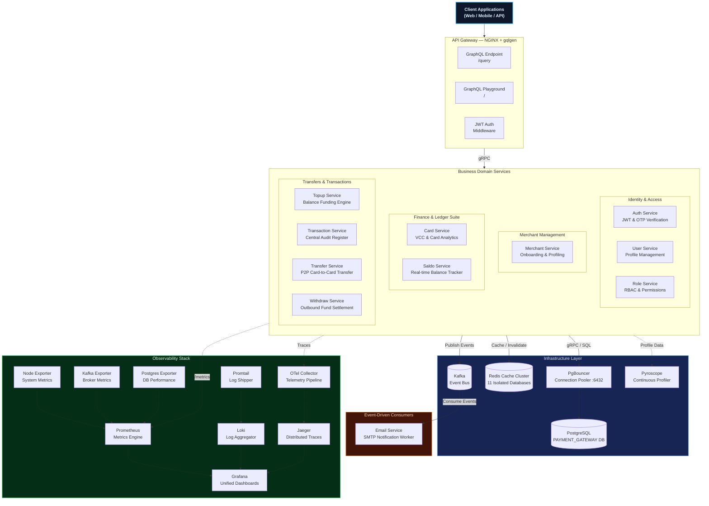
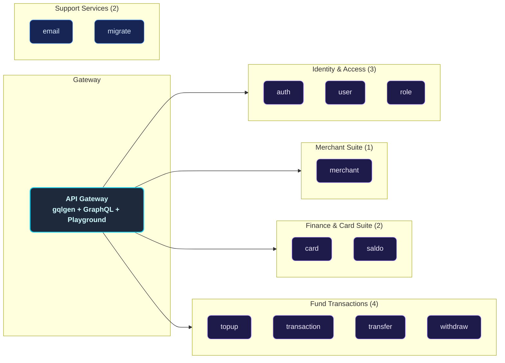
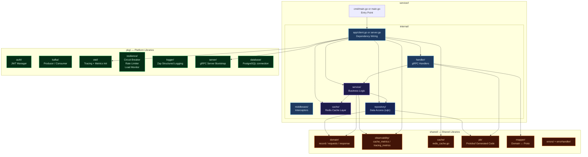
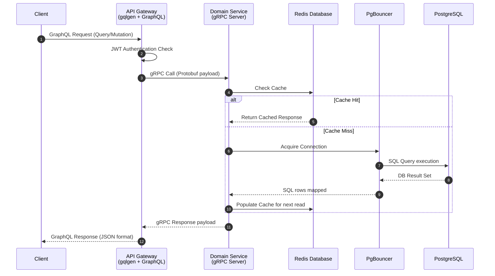
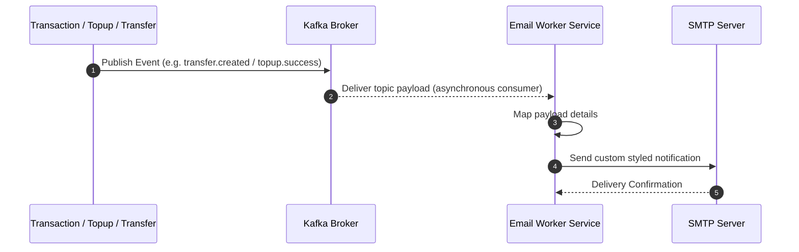
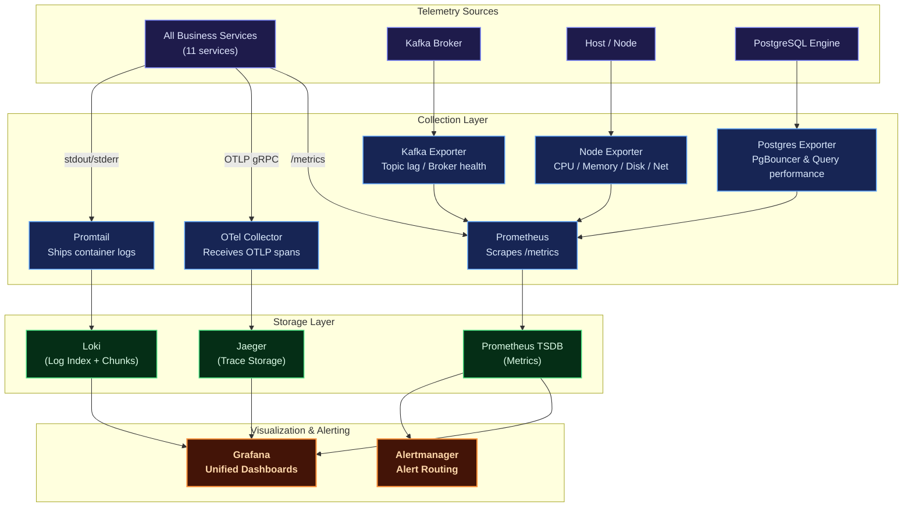
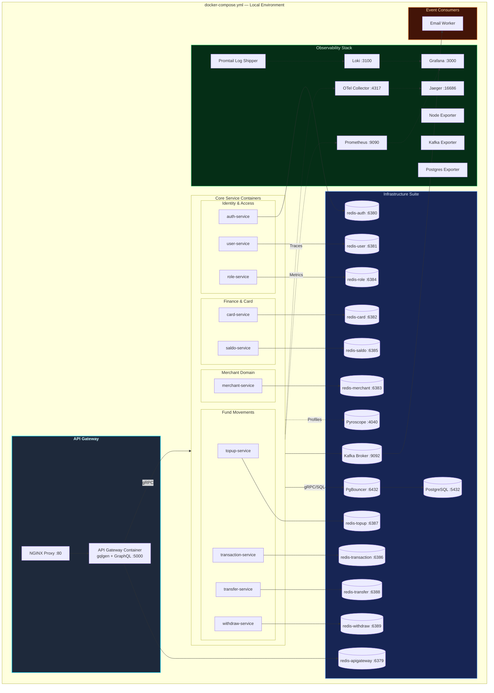
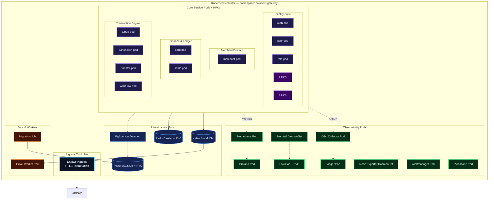

A production-grade, highly resilient, and fully observable **modular-monolith payment gateway backend** built in **Go (Golang)**. Designed around domain-driven service boundaries following Clean Architecture principles, it retains the operational and deployment simplicity of a single deployment unit while maintaining logical isolation typical of microservices.

Each financial and identity business domain — Users, Roles, Cards, Merchants, Saldo, Topups, Transactions, Transfers, Withdrawals — lives in its own self-contained module. These modules communicate synchronously via lightweight **gRPC** protocols and asynchronously using **Apache Kafka** event propagation, exposing a unified entry point through a **GraphQL API Gateway** (NGINX + gqlgen).

The platform is fortified with a **comprehensive observability suite** (Prometheus, Grafana, Loki, Jaeger, OpenTelemetry, Pyroscope), robust connection pooling via **PgBouncer**, **isolated Redis caching** with custom telemetry for each service, and Kubernetes configurations ready for production auto-scaling.

---

## Key Features

| Domain | Capabilities |
| :--- | :--- |
| **Auth & Users** | Secure registration, multi-factor login, stateless JWT access/refresh token lifecycle, password reset workflows, OTP email verification, and `GetMe` profile resolver. |
| **Roles & RBAC** | Custom permission configuration, granular access control matrices, and sub-second permission evaluation cached via Redis. |
| **Cards & VCC** | Virtual and debit card CRUD operations with soft-delete capabilities, card activation/suspension toggles, and multi-dimensional transaction analytics (daily/monthly/yearly topup, withdraw, transfer). |
| **Merchants** | Fully featured merchant onboarding, profile details management, business data registration, and merchant performance/transaction reports with full data restoration capabilities (soft delete & restore). |
| **Saldo (Balance)** | High-throughput, thread-safe real-time balance calculations, optimistic concurrency locks, and localized balances. |
| **Topup** | Balance loading ledger engine supporting multiple payment methods, detailed transactions logging, and soft-delete audit records. |
| **Transaction** | Centralized financial audit ledger collecting transaction events across the system, global search filters, status tracking, and monthly/yearly volume reports. |
| **Transfer** | Safe peer-to-peer card-to-card or user-to-user funds settlement with balance debit/credit synchronization and event-driven logging. |
| **Withdraw** | Funds settlement from user cards to external accounts/banks, daily transaction threshold limits, and status processing pipelines. |
| **Email Worker** | Kafka-driven asynchronous worker dispatching critical notification emails (OTPs, login alerts, merchant onboarding notices, and transfer/topup invoices) via SMTP. |
| **Observability** | Multi-dimensional metrics (Prometheus + Grafana), log aggregation (Loki + Promtail), end-to-end distributed tracing (Jaeger + OpenTelemetry), continuous CPU/Memory profiling (Pyroscope), and resource monitors (Node, Kafka, Postgres Exporters). |
| **Deployment** | Local orchestration using Docker Compose (featuring individual Redis instances and PgBouncer), and auto-scaling Kubernetes manifests configured with Horizontal Pod Autoscalers (HPA). |

---

## Architecture Overview

The platform implements a **Distributed Modular Monolith** architecture. Each business service is logical, decoupled, and self-contained inside the `service/` directory, possessing its own independent gRPC boundary. An **API Gateway** (gqlgen + NGINX) acts as the unified edge router, transforming client GraphQL queries and mutations into fast gRPC downstream communications.

### Core Architecture Principles

- **Domain-Driven Boundary Isolation**: Every service owns its database access, caching layers, and service logic, strictly forbidding cross-boundary database sharing.
- **Clean Architecture**: Standardized layers of `handler → service → repository` ensure that business domains remain unaffected by framework or database changes.
- **PgBouncer Pooling**: Employs connection pooling to avoid PostgreSQL socket exhaustion across the multiple concurrent modular services.
- **Event-Driven Resilience**: Apache Kafka decouples transaction events, ensuring side effects like email billing remain completely non-blocking.
- **OTel Telemetry Integration**: Standardized OpenTelemetry middleware injects trace IDs across gRPC boundaries, allowing seamless trace propagation from the client GraphQL edge down to postgres operations.



---

## Service Catalog

The modular architecture consists of **12 logical micro-applications** plus supporting database and migrations:



---

## Internal Service Architecture

Every logical business service is mapped as a decoupled submodule following structured clean architecture rules.



---

## Data & Event Flow

### Synchronous Flow (gRPC & Cache Read-Through)

All external client API requests go through GraphQL queries or mutations. The API Gateway authorizes the JWT, connects with the correct downstream gRPC modular server, checks Redis caching, and fetches PostgreSQL through PgBouncer if a cache miss happens.



### Asynchronous Flow (Kafka Notification Event pipeline)

High-performance transaction modifications (like transfers or top-ups) trigger background notification events published directly to Apache Kafka brokers. The isolated Email service listens to Kafka, maps the events, and contacts Ethereal/SMTP services.



---

## Observability Architecture



| Pillar | Tool | Purpose |
| :--- | :--- | :--- |
| **Metrics** | Prometheus + Grafana | Core metrics tracking (CPU, memory, request error rates, gRPC latencies, DB connection states). |
| **Logging** | Loki + Promtail | Centralized structured JSON logger for indexing logs by service, queryable via LogQL. |
| **Tracing** | OpenTelemetry + Jaeger | Distributed system tracing across API gateway and internal gRPC services. |
| **Profiling** | Pyroscope | Continuous memory/CPU profiling to eliminate allocation memory leaks in transaction loops. |
| **Alerting** | Alertmanager | Automated notification system triggered during latency hikes or service disconnects. |

---

## Deployment Architectures

### Docker Compose (Local Development)

The Docker Compose configuration provisions 11 isolated database setups inside a single containerized environment to replicate real microservices patterns.



### Kubernetes (Production Ready)

Our enterprise Kubernetes infrastructure resides inside the dedicated `payment-gateway` namespace, configuring scalable nodes utilizing Horizontal Pod Autoscalers.



---

## Technology Stack

| Category | Selected Technologies | Purpose |
| :--- | :--- | :--- |
| **Language** | Go (Golang v1.25) | High-performance compiled concurrent backend execution. |
| **API Edge Gateway** | gqlgen (GraphQL) | Modern, strongly typed API Gateway engine and playground. |
| **RPC Inter-service** | gRPC + Protobuf | Blazing fast, contract-first synchronous communications. |
| **Database** | PostgreSQL v17 | Safe ACID ledger persistent storage system. |
| **Database Gateway**| PgBouncer | Extreme-efficiency PostgreSQL socket connection pooler. |
| **Type-Safe SQL** | sqlc | Code generator translating strict raw SQL queries into Go code. |
| **DB Migrations** | Goose | Incremental database schema version manager. |
| **Caching Tier** | Redis | Multi-database low-latency key-value cached engine. |
| **Messaging Stream** | Apache Kafka | Asynchronous high-throughput messaging event bus. |
| **Token Manager** | JWT | Secure stateless request authentication standard. |
| **Observability** | OpenTelemetry + Jaeger | Vendor-neutral distributed telemetry pipeline and visualization. |
| **Continuous Profiler**| Pyroscope | Real-time memory allocation tracker to identify hot paths. |
| **Docker Engine** | Compose | Local environment virtualization orchestration. |
| **Orchestrator** | Kubernetes | Production-scale auto-scaling pod clustering infrastructure. |

---

## Getting Started

### Prerequisites

Ensure the following system packages are locally configured:

- [Git](https://git-scm.com/)
- [Go](https://go.dev/) (v1.23+)
- [Docker](https://www.docker.com/) & [Docker Compose](https://docs.docker.com/compose/)
- [Just Task Runner](https://github.com/casey/just) or Standard `Make`
- [Protobuf Compiler](https://grpc.io/docs/protoc-installation/) (for codegen updates)

### 1. Clone the Workspace

```sh
git clone https://github.com/MamangRust/monolith-graphql-paymentgateway-grpc.git
cd monolith-graphql-paymentgateway-grpc
```

### 2. Prepare Environment Configurations

Setup the system configurations from placeholders:

```sh
# Copy root variables
cp .env.example .env

# Copy local docker settings overrides
cp deployments/local/docker.env.example deployments/local/docker.env
```

### 3. Start Local Environment (Docker Compose)

Launch all infrastructure utilities, telemetry containers, and application submodules:

```sh
# Compile Docker images & boot Compose layers
make build-up
# Or using Just:
just build-up

# Execute Goose migration scripts
make migrate
# Or using Just:
just migrate

# (Optional) Insert development mock data into DB
make seeder
# Or using Just:
just seeder
```

Ensure everything has booted successfully:

```sh
make ps
# Or using Just:
just ps
```

### 4. Port Map Registry

| Application/Service | Port Configuration / URL |
| :--- | :--- |
| **GraphQL Playground Edge** | [http://localhost](http://localhost) |
| **GraphQL Endpoint Edge** | [http://localhost/query](http://localhost/query) |
| **API Gateway Direct** | [http://localhost:5000](http://localhost:5000) |
| **API Gateway Direct Query** | [http://localhost:5000/query](http://localhost:5000/query) |
| **Grafana Dashboard Portal** | [http://localhost:3000](http://localhost:3000) *(Credentials: `admin`/`admin`)* |
| **Prometheus Telemetry** | [http://localhost:9090](http://localhost:9090) |
| **Jaeger Distributed Tracing** | [http://localhost:16686](http://localhost:16686) |
| **Pyroscope Profiling Panel** | [http://localhost:4040](http://localhost:4040) |
| **PgBouncer Gateway Node** | `localhost:6432` |
| **PostgreSQL Database Engine** | `localhost:5432` |

To fully stop the development system:

```sh
make down
# Or using Just:
just down
```

---

## Makefile / Justfile Reference

The workspace includes a standard `Makefile` and `justfile` featuring mirroring tasks:

| Target/Recipe | Execution Scope |
| :--- | :--- |
| `build-up` / `just build-up` | Recompiles local service Dockerfiles and launches the compose stacks. |
| `up` / `just up` | Launches existing Compose containers without rebuilding images. |
| `down` / `just down` | Stops the local compose container stacks and releases networks. |
| `ps` / `just ps` | Displays health, uptime, and mapped ports of the container cluster. |
| `migrate` / `just migrate` | Triggers PostgreSQL schema updates via the migrate binary. |
| `migrate-down` / `just migrate-down` | Rolls back the latest database migration states. |
| `seeder` / `just seeder` | Populates mock entities (cards, users, roles, merchants). |
| `generate-proto` / `just generate-proto` | Compiles `.proto` files down into Go models within `/pb`. |
| `generate-sql` / `just generate-sql` | Recompiles sqlc repository codes from queries. |
| `generate-swagger` / `just generate-swagger` | Regenerates OpenAPI/Swagger schema specifications. |
| `just generate-graphql` | Invokes gqlgen mapping directives to synchronize resolver bindings. |
| `test-auth` / `just test-auth` | Executes integration tests for the `auth` module. |
| `just test-unit` | Executes Go standard library test routines under `pkg/`. |
| `just test-integration` | Triggers end-to-end integration flows under `tests/`. |
| `just test-all` | Chain-runs standard unit tests alongside integration suites. |
| `just build` | Locally compiles all sub-services into unified `bin/` folders. |
| `just tidy-all` | Iterates across all go modules, executing `go mod tidy` cleanups. |

---

## Workspace Directory Tree

```
monolith-graphql-paymentgateway-grpc/
├── proto/                          # Protobuf contracts (12 domains)
│   ├── auth.proto                  #   Identity tokens contracts
│   ├── card/                       #   Virtual Card specifications
│   ├── common/                     #   Shared protobuf data types
│   ├── merchant/                   #   Merchant account declarations
│   ├── merchant_document/          #   Verification files specifications
│   ├── role/                       #   Role mapping specifications
│   ├── saldo/                      #   Balance updates specifications
│   ├── topup/                      #   Funding balance specifications
│   ├── transaction/                #   General audit register specifications
│   ├── transfer/                   #   Peer-to-peer transaction specifications
│   ├── user/                       #   User CRUD data properties
│   └── withdraw/                   #   Bank settlement configurations
├── shared/                         # Consolidated workspace module
│   ├── pb/                         #   Compiled protobuf outputs
│   ├── domain/                     #   Internal domain models & requests
│   ├── mapper/                     #   Bidirectional converters (Proto ↔ Go)
│   ├── cache/                      #   Redis caching wrappers
│   ├── observability/              #   Cache/Tracing monitoring interceptors
│   ├── errors/                     #   Localized error templates
│   └── errorhandler/               #   Global transaction handlers
├── pkg/                            # Multi-project utilities module
│   ├── adapter/                    #   External connection controllers
│   ├── api-key/                    #   API Key generation & validation
│   ├── auth/                       #   JWT authentication utilities
│   ├── database/                   #   Relational DB initialization hooks
│   ├── date/                       #   Time utilities
│   ├── dotenv/                     #   Environment loader helper
│   ├── email/                      #   SMTP email driver
│   ├── hash/                       #   Bcrypt cryptography utilities
│   ├── kafka/                      #   Kafka writer/reader configurations
│   ├── logger/                     #   Structured Zap logs wrappers
│   ├── method_topup/               #   Valid top-up methods definitions
│   ├── middleware/                 #   HTTP/gRPC general middleware
│   ├── otel/                       #   Telemetry hooks config
│   ├── random_string/              #   String helper generators
│   ├── randomvcc/                  #   VCC balance issuer helpers
│   ├── redis/                      #   Redis backend connectors
│   ├── resilience/                 #   Circuit breaker, rate limiter, load monitor
│   ├── rupiah/                     #   Indonesian Rupiah cash mappings
│   ├── server/                     #   gRPC bootstrap templates
│   └── trace_unic/                 #   Observability tracing utilities
├── service/                        # Isolated functional business domains
│   ├── apigateway/                 #   Unified GraphQL endpoint gateway
│   ├── auth/                       #   Identity authentication engine
│   ├── user/                       #   User profiles administration
│   ├── role/                       #   RBAC authorization configurations
│   ├── merchant/                   #   Merchants registration
│   ├── card/                       #   Debit & VCC virtual logs
│   ├── saldo/                      #   Real-time balance records
│   ├── topup/                      #   Funding balance processor
│   ├── transaction/                #   Central audit ledger service
│   ├── transfer/                   #   P2P funding transfer engine
│   ├── withdraw/                   #   Outbound settlement handler
│   ├── email/                      #   Asynchronous Kafka notification worker
│   └── migrate/                    #   Incremental DB migrations runner
├── deployments/
│   ├── local/                      #   Docker compose infrastructure scripts
│   └── kubernetes/                 #   Production K8s manifests ( deployments, HPAs, volumes)
├── observability/                  #   Telemetry pipeline yaml profiles (Loki, OTEL, Promtail)
├── grafana/                        #   Pre-configured dashboard templates
├── nginx/                          #   Reverse-proxy edge rules
├── redis/                          #   Advanced Redis configs
└── images/                         #   Architecture diagrams & dashboard screenshots
```
---

## Source Code
[View on GitHub](https://github.com/MamangRust/monolith-graphql-ecommerce)

---

<p align="center">
  Built with Go, gRPC, Apache Kafka, and a passion for high-performance modular monoliths.
</p>