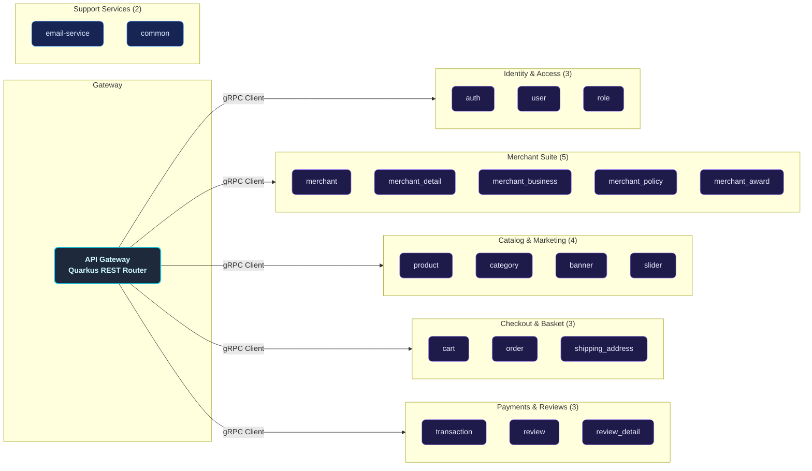
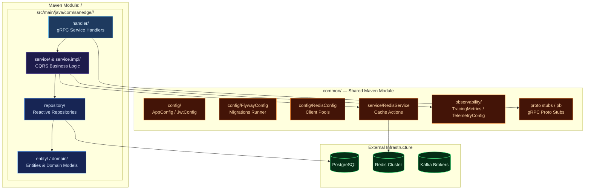
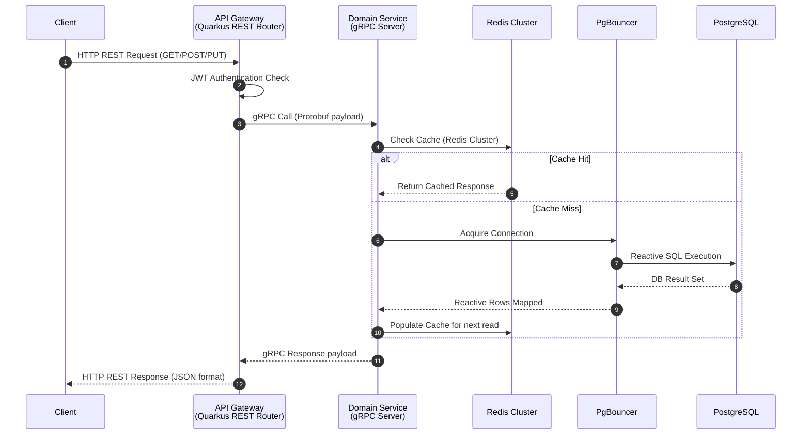
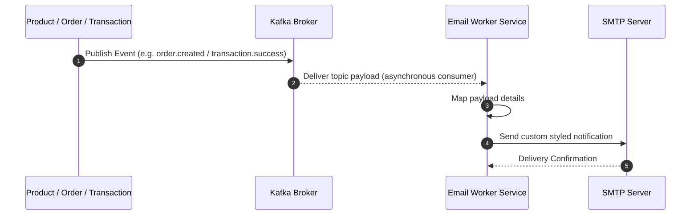
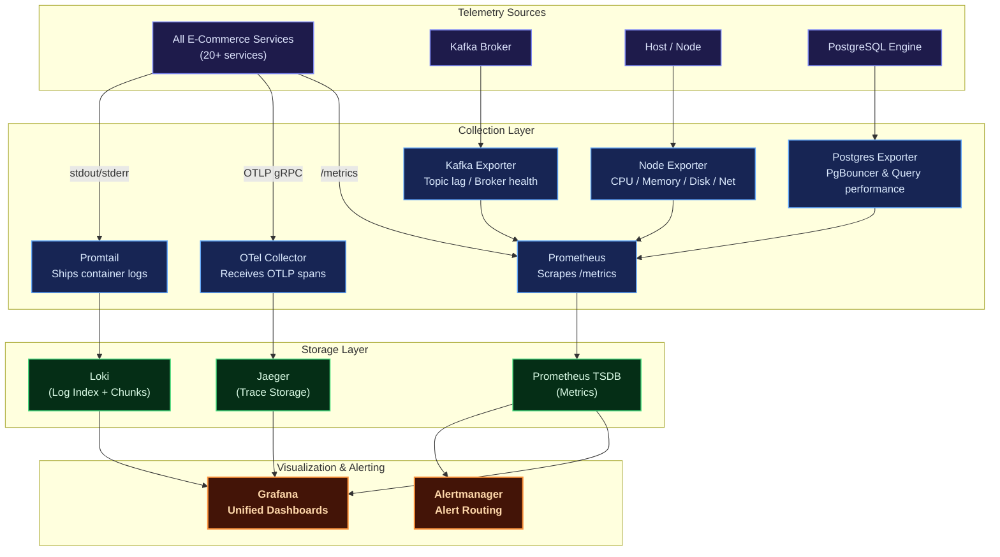
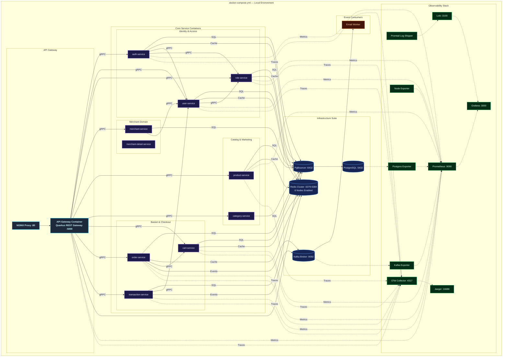

# Distributed Modular Monolith — E-Commerce Platform (Java Quarkus)

A production-grade, highly resilient, and fully observable **modular-monolith e-commerce backend** built in **Java 21** using **Quarkus** reactive framework (v3.31.3). Designed around domain-driven service boundaries following Clean Architecture and CQRS principles, it retains the operational and deployment simplicity of a single deployment unit while maintaining logical isolation typical of microservices.

Each e-commerce business domain — Users, Roles, Auth, Products, Categories, Cart, Orders, Shipping, Merchants, Reviews, Transactions, Banners, Sliders — lives in its own self-contained Maven module. These modules communicate synchronously via high-performance **gRPC** protocols and asynchronously using **Apache Kafka** event propagation, exposing a unified reactive entry point through a **REST API Gateway** powered by Quarkus RESTEasy Reactive.

The platform is fortified with a **comprehensive observability suite** (Prometheus, Grafana, Loki, Jaeger, OpenTelemetry), robust connection pooling via **PgBouncer**, **distributed Redis Cluster caching** with custom telemetry for each service, and Kubernetes configurations ready for production auto-scaling.

---

## Key Features

| Domain | Capabilities |
| :--- | :--- |
| **Auth & Users** | Secure registration, multi-factor login, stateless JWT access/refresh token lifecycle, password reset workflows, OTP email verification, and `/me` profile REST endpoint. |
| **Roles & RBAC** | Custom permission configuration, granular access control matrices, and sub-second permission evaluation cached via Redis. |
| **Catalog & Products** | Full CRUD for products & categories, promo banners, and home slider carousels. |
| **Cart & Commerce** | Add-to-cart, checkout workflows, order lifecycle management, order-item decomposition, and shipping address details. |
| **Merchants** | Fully featured merchant onboarding, profile details management, business data registration, policies, and merchant awards. |
| **Transactions** | Centralized financial audit ledger collecting transaction and payment events across the system, global search filters, and status tracking. |
| **Reviews** | Product ratings & detailed review submissions post-purchase. |
| **Email Worker** | Kafka-driven asynchronous worker dispatching critical notification emails (OTPs, login alerts, merchant onboarding notices, and transaction invoices) via SMTP. |
| **Observability** | Multi-dimensional metrics (Prometheus + Grafana), log aggregation (Loki + Logback), end-to-end distributed tracing (Jaeger + OpenTelemetry), and resource monitors (Node, Kafka, Postgres Exporters). |
| **Deployment** | Local orchestration using Docker Compose (featuring a 6-node Redis Cluster and PgBouncer), and auto-scaling Kubernetes manifests configured with Horizontal Pod Autoscalers (HPA). |

---

## Architecture Overview

The platform implements a **Distributed Modular Monolith** architecture. Each business service is logical, decoupled, and self-contained inside its own Maven submodule, possessing its own independent gRPC boundary. A **Quarkus REST API Gateway** acts as the unified edge router, transforming client HTTP REST requests into fast gRPC downstream communications via Quarkus gRPC clients.

### Core Architecture Principles

- **Domain-Driven Boundary Isolation**: Every service owns its database access, caching layers, and service logic, strictly forbidding cross-boundary database sharing.
- **Clean Architecture & CQRS**: Separation of concerns using `Handler (gRPC) → Service (Command/Query) → Repository (Command/Query)` layers ensures business logic remains clean, performant, and framework-agnostic.
- **Reactive execution**: Powered entirely by Quarkus reactive engine and Mutiny, enabling high throughput with minimal resource footprints.
- **PgBouncer Pooling**: Employs connection pooling to avoid PostgreSQL socket exhaustion across the multiple concurrent modular services.
- **Event-Driven Resilience**: Apache Kafka decouples transaction events, ensuring side effects like email billing remain completely non-blocking.
- **OTel Telemetry Integration**: Standardized OpenTelemetry middleware injects trace IDs across gRPC boundaries, allowing seamless trace propagation from the client REST gateway down to postgres operations.

```mermaid
graph TB
    classDef client fill:#0f172a,stroke:#38bdf8,color:#e0f2fe,stroke-width:2px,font-weight:bold
    classDef gateway fill:#1e293b,stroke:#22d3ee,color:#cffafe,stroke-width:2px,font-weight:bold
    classDef domain fill:#1e1b4b,stroke:#818cf8,color:#e0e7ff,stroke-width:1.5px
    classDef infra fill:#172554,stroke:#60a5fa,color:#dbeafe,stroke-width:1.5px
    classDef obs fill:#052e16,stroke:#4ade80,color:#dcfce7,stroke-width:1.5px
    classDef event fill:#431407,stroke:#fb923c,color:#fed7aa,stroke-width:1.5px

    Client["Client Applications<br/>(Web / Mobile / API)"]:::client

    subgraph APIGateway["API Gateway — NGINX + Quarkus REST Gateway"]
        direction LR
        REST["REST API Route Handler<br/>Port :5000"]:::gateway
        AuthMW["JWT Auth & Role<br/>Middleware"]:::gateway
    end

    Client -->|HTTP REST| APIGateway

    subgraph BusinessServices["Business Domain Services (Java Quarkus)"]
        direction TB

        subgraph IdentityDomain["Identity & Access"]
            AUTH["Auth Service<br/>JWT & BCrypt Server"]:::domain
            USER["User Service<br/>Profile Management"]:::domain
            ROLE["Role Service<br/>RBAC & Permissions"]:::domain
        end

        subgraph MerchantDomain["Merchant Suite"]
            MERCH["Merchant Service<br/>Onboarding & Profiling"]:::domain
            MERCH_DETAIL["Merchant Detail Service"]:::domain
            MERCH_BIZ["Merchant Business Service"]:::domain
            MERCH_POLICY["Merchant Policy Service"]:::domain
            MERCH_AWARD["Merchant Award Service"]:::domain
        end

        subgraph CatalogDomain["Catalog & Marketing"]
            PROD["Product Service<br/>Product Catalog CRUD"]:::domain
            CAT["Category Service<br/>Product Categorization"]:::domain
            BANNER["Banner Service<br/>Offers & Promos"]:::domain
            SLIDER["Slider Service<br/>Carousel Slides"]:::domain
        end

        subgraph OrderDomain["Checkout & Cart"]
            CART["Cart Service<br/>Basket Operations"]:::domain
            ORDER["Order Service<br/>Checkout & Order Flows"]:::domain
            SHIP["Shipping Service<br/>Customer Addresses"]:::domain
        end

        subgraph TransactionDomain["Payments & Reviews"]
            TXN["Transaction Service<br/>Central Audit Register"]:::domain
            REV["Review Service<br/>Ratings & Feedback"]:::domain
            REV_DTL["Review Detail Service"]:::domain
        end
    end

    REST -->|"Quarkus gRPC Client"| AUTH
    REST -->|"Quarkus gRPC Client"| USER
    REST -->|"Quarkus gRPC Client"| ROLE
    REST -->|"Quarkus gRPC Client"| MERCH
    REST -->|"Quarkus gRPC Client"| PROD
    REST -->|"Quarkus gRPC Client"| CAT
    REST -->|"Quarkus gRPC Client"| BANNER
    REST -->|"Quarkus gRPC Client"| SLIDER
    REST -->|"Quarkus gRPC Client"| CART
    REST -->|"Quarkus gRPC Client"| ORDER
    REST -->|"Quarkus gRPC Client"| TXN
    REST -->|"Quarkus gRPC Client"| REV

    subgraph Infrastructure["Infrastructure Layer"]
        direction LR
        PGBOUNCER["PgBouncer<br/>Connection Pooler :6432"]:::infra
        PG[("PostgreSQL<br/>ECOMMERCE DB")]:::infra
        REDIS[("Redis Cluster<br/>6-Node Distributed Cache")]:::infra
        KAFKA[("Kafka Broker<br/>Event Bus")]:::infra
    end

    AUTH -->|"Reactive SQL Client"| PGBOUNCER
    USER -->|"Reactive SQL Client"| PGBOUNCER
    ROLE -->|"Reactive SQL Client"| PGBOUNCER
    MERCH -->|"Reactive SQL Client"| PGBOUNCER
    PROD -->|"Reactive SQL Client"| PGBOUNCER
    CAT -->|"Reactive SQL Client"| PGBOUNCER
    CART -->|"Reactive SQL Client"| PGBOUNCER
    ORDER -->|"Reactive SQL Client"| PGBOUNCER
    TXN -->|"Reactive SQL Client"| PGBOUNCER
    REV -->|"Reactive SQL Client"| PGBOUNCER

    PGBOUNCER --> PG

    AUTH -->|"Quarkus Redis client"| REDIS
    USER -->|"Quarkus Redis client"| REDIS
    ROLE -->|"Quarkus Redis client"| REDIS
    PROD -->|"Quarkus Redis client"| REDIS
    ORDER -->|"Quarkus Redis client"| REDIS
    CART -->|"Quarkus Redis client"| REDIS
    REST -->|"Quarkus Redis client"| REDIS

    subgraph EventConsumers["Event-Driven Consumers"]
        EMAIL["Email Service<br/>SMTP Notification Worker"]:::event
    end

    KAFKA -->|"Consume Events"| EMAIL

    subgraph Observability["Observability Stack"]
        direction LR
        PROM["Prometheus<br/>Metrics Engine"]:::obs
        LOKI["Loki<br/>Log Aggregator"]:::obs
        JAEGER["Jaeger<br/>Distributed Traces"]:::obs
        GRAFANA["Grafana<br/>Unified Dashboards"]:::obs
        OTEL["OTel Collector<br/>Telemetry Pipeline"]:::obs
        PROMTAIL["Promtail<br/>Log Shipper"]:::obs
        NODEX["Node Exporter<br/>System Metrics"]:::obs
        KAFKAX["Kafka Exporter<br/>Broker Metrics"]:::obs
        PGX["Postgres Exporter<br/>DB Performance"]:::obs
    end

    AUTH -->|gRPC| USER
    AUTH -->|gRPC| ROLE
    MERCH -->|gRPC| USER
    ORDER -->|gRPC| CART
    ORDER -->|gRPC| SHIP
    TXN -->|gRPC| ORDER
    TXN -->|gRPC| USER
    REV -->|gRPC| PROD
    REV -->|gRPC| USER

    AUTH -.->|"Publish Verification Event"| KAFKA
    ORDER -.->|"Publish Order Event"| KAFKA
    TXN -.->|"Publish Transaction Event"| KAFKA

    AUTH -.->|"/metrics"| PROM
    USER -.->|"/metrics"| PROM
    PROD -.->|"/metrics"| PROM
    ORDER -.->|"/metrics"| PROM
    TXN -.->|"/metrics"| PROM
    REST -.->|"/metrics"| PROM

    AUTH -.->|"OTLP Spans"| OTEL
    USER -.->|"OTLP Spans"| OTEL
    PROD -.->|"OTLP Spans"| OTEL
    ORDER -.->|"OTLP Spans"| OTEL
    TXN -.->|"OTLP Spans"| OTEL
    REST -.->|"OTLP Spans"| OTEL

    OTEL -.-> JAEGER
    PROMTAIL -.-> LOKI
    NODEX -.-> PROM
    KAFKAX -.-> PROM
    PGX -.-> PROM
    PROM -.-> GRAFANA
    LOKI -.-> GRAFANA
    JAEGER -.-> GRAFANA
    KAFKA -.-> KAFKAX
    PG -.-> PGX
```



---

## Service Catalog

The modular architecture consists of **21 logical micro-applications** plus supporting database and migrations:



---

## Internal Service Architecture

Every logical business service is mapped as a decoupled submodule following structured clean architecture rules.



---

## Data & Event Flow

### Synchronous Flow (REST Proxy & Cache Read-Through)

All external client API requests go through the REST endpoints defined in the Quarkus API Gateway Router. The API Gateway validates the JWT/API Key, connects with the correct downstream gRPC modular server, checks the Redis Cluster cache, and fetches PostgreSQL through PgBouncer if a cache miss occurs.



### Asynchronous Flow (Kafka Notification Event pipeline)

High-performance transaction modifications trigger background notification events published directly to Apache Kafka brokers. The isolated Email service listens to Kafka, maps the events, and sends SMTP email notifications.



---

## Observability Architecture



| Pillar | Tool | Purpose |
| :--- | :--- | :--- |
| **Metrics** | Prometheus + Grafana | Core metrics tracking (CPU, memory, request error rates, gRPC latencies, DB connection states). |
| **Logging** | Loki + Logback | Centralized structured JSON logger for indexing logs by service, queryable via LogQL. |
| **Tracing** | OpenTelemetry + Jaeger | Distributed system tracing across API gateway and internal gRPC services. |
| **Alerting** | Alertmanager | Automated notification system triggered during latency hikes or service disconnects. |

---

## Deployment Architectures

### Docker Compose (Local Development)

The Docker Compose configuration provisions a 6-node Redis Cluster along with databases, event brokers, and reactive service containers to replicate a microservices environment.



---

### Kubernetes (Production Clustering)

The production-grade Kubernetes architecture is designed for high availability, fault tolerance, and seamless horizontal scaling. All manifests are defined inside the custom `ecommerce` namespace, route edge traffic using NGINX pods acting as a LoadBalancer, and manage service scalability using individual HPAs.

```mermaid
flowchart TB
    classDef client fill:#0f172a,stroke:#38bdf8,color:#e0f2fe,stroke-width:2px,font-weight:bold
    classDef ingress fill:#0f172a,stroke:#06b6d4,color:#e0f7fa,stroke-width:2px,font-weight:bold
    classDef k8sSvc fill:#1e293b,stroke:#22d3ee,color:#cffafe,stroke-width:2px,font-weight:bold
    classDef pod fill:#1e1b4b,stroke:#a78bfa,color:#ede9fe,stroke-width:1.5px
    classDef stateful fill:#172554,stroke:#60a5fa,color:#dbeafe,stroke-width:1.5px
    classDef hpa fill:#064e3b,stroke:#34d399,color:#ecfdf5,stroke-width:1px,stroke-dasharray: 5 5
    classDef obs fill:#052e16,stroke:#4ade80,color:#dcfce7,stroke-width:1.5px

    Client["Client Applications<br/>(HTTPS Requests)"]:::client

    subgraph K8sCluster["Kubernetes Cluster — Namespace: ecommerce"]
        direction TB

        subgraph IngressLayer["Edge Reverse Proxy (NGINX)"]
            NGINX_SVC["nginx-service<br/>(LoadBalancer :80)"]:::k8sSvc
            NGINX_POD["nginx-pods"]:::pod
        end

        subgraph GatewayServices["REST API Gateway (Scalable Deployment)"]
            APIGW_SVC["apigateway-service<br/>(ClusterIP :5000)"]:::k8sSvc
            APIGW_PODS["apigateway-pods"]:::pod
            APIGW_HPA["apigateway-hpa"]:::hpa
        end

        subgraph DomainServices["Internal gRPC Microservices"]
            direction TB
            
            subgraph IdentityZone["Identity Suite"]
                AUTH_POD["auth-pods"]:::pod
                USER_POD["user-pods"]:::pod
                ROLE_POD["role-pods"]:::pod
                AUTH_SVC["auth-service (gRPC)"]:::k8sSvc
                USER_SVC["user-service (gRPC)"]:::k8sSvc
                ROLE_SVC["role-service (gRPC)"]:::k8sSvc
            end

            subgraph MerchantZone["Merchant Suite"]
                MERCH_POD["merchant-pods"]:::pod
                MERCH_SVC["merchant-service (gRPC)"]:::k8sSvc
            end

            subgraph CatalogZone["Catalog & Products"]
                PROD_POD["product-pods"]:::pod
                CAT_POD["category-pods"]:::pod
                PROD_SVC["product-service (gRPC)"]:::k8sSvc
                CAT_SVC["category-service (gRPC)"]:::k8sSvc
            end

            subgraph MovementsZone["Ledgers & Checkout Flow"]
                CART_POD["cart-pods"]:::pod
                ORDER_POD["order-pods"]:::pod
                TX_POD["transaction-pods"]:::pod
                CART_SVC["cart-service (gRPC)"]:::k8sSvc
                ORDER_SVC["order-service (gRPC)"]:::k8sSvc
                TX_SVC["transaction-service (gRPC)"]:::k8sSvc
            end
            
            PodsHPA["Domain Services HPAs<br/>(auth, product, merchant, order, etc.)"]:::hpa
        end

        subgraph DataObservability["Infrastructure & Databases"]
            PGB_SVC["pgbouncer-service<br/>(ClusterIP :6432)"]:::k8sSvc
            PGB_POD["pgbouncer-pods"]:::pod

            PG_SVC["postgres-service<br/>(ClusterIP :5432)"]:::k8sSvc
            PG_POD["postgres-pods"]:::pod
            
            REDIS_SVC["redis-cluster-service<br/>(ClusterIP :6379)"]:::k8sSvc
            REDIS_SET[("redis-cluster StatefulSet<br/>(6-Node Shards)")]:::stateful
            
            KAFKA_SVC["kafka-service<br/>(ClusterIP :9092)"]:::k8sSvc
            KAFKA_POD["kafka-pods"]:::pod
        end

        subgraph BackgroundWorkers["Event Consumers"]
            EMAIL_SVC["email-service<br/>(ClusterIP)"]:::k8sSvc
            EMAIL_PODS["email-pods"]:::pod
            EMAIL_HPA["email-hpa"]:::hpa
        end

        subgraph K8sObs["Observability Namespace Suite"]
            PROM_SVC["prometheus-service<br/>(ClusterIP :9090)"]:::k8sSvc
            PROM_POD["prometheus-pod"]:::pod

            OTEL_SVC["otel-collector-service<br/>(ClusterIP :4317)"]:::k8sSvc
            OTEL_POD["otel-collector-pod"]:::pod

            LOKI_SVC["loki-service<br/>(ClusterIP :3100)"]:::k8sSvc
            LOKI_POD["loki-pod"]:::pod

            JAEGER_SVC["jaeger-service<br/>(ClusterIP :16686)"]:::k8sSvc
            JAEGER_POD["jaeger-pod"]:::pod

            GRAFANA_SVC["grafana-service<br/>(ClusterIP :3000)"]:::k8sSvc
            GRAFANA_POD["grafana-pod"]:::pod

            ALERTMGR_SVC["alertmanager-service<br/>(ClusterIP :9093)"]:::k8sSvc
            ALERTMGR_POD["alertmanager-pod"]:::pod

            PROMTAIL["promtail-daemonset"]:::pod
            
            KAFKAX_SVC["kafka-exporter-service"]:::k8sSvc
            KAFKAX_POD["kafka-exporter-pod"]:::pod

            NODEX_SVC["node-exporter-service"]:::k8sSvc
            NODEX_POD["node-exporter-daemonset"]:::pod
        end
    end

    Client -->|HTTPS :443| NGINX_SVC
    NGINX_SVC --> NGINX_POD
    NGINX_POD -->|Proxy Pass| APIGW_SVC
    APIGW_SVC --> APIGW_PODS
    APIGW_HPA -.->|Autoscales| APIGW_PODS

    APIGW_PODS -->|gRPC call| AUTH_SVC
    APIGW_PODS -->|gRPC call| USER_SVC
    APIGW_PODS -->|gRPC call| ROLE_SVC
    APIGW_PODS -->|gRPC call| MERCH_SVC
    APIGW_PODS -->|gRPC call| PROD_SVC
    APIGW_PODS -->|gRPC call| CAT_SVC
    APIGW_PODS -->|gRPC call| CART_SVC
    APIGW_PODS -->|gRPC call| ORDER_SVC
    APIGW_PODS -->|gRPC call| TX_SVC
    
    AUTH_SVC --> AUTH_POD
    USER_SVC --> USER_POD
    ROLE_SVC --> ROLE_POD
    MERCH_SVC --> MERCH_POD
    PROD_SVC --> PROD_POD
    CAT_SVC --> CAT_POD
    CART_SVC --> CART_POD
    ORDER_SVC --> ORDER_POD
    TX_SVC --> TX_POD

    AUTH_POD -->|SQL| PGB_SVC
    USER_POD -->|SQL| PGB_SVC
    ROLE_POD -->|SQL| PGB_SVC
    MERCH_POD -->|SQL| PGB_SVC
    PROD_POD -->|SQL| PGB_SVC
    CAT_POD -->|SQL| PGB_SVC
    CART_POD -->|SQL| PGB_SVC
    ORDER_POD -->|SQL| PGB_SVC
    TX_POD -->|SQL| PGB_SVC

    PGB_SVC --> PGB_POD
    PGB_POD -->|SQL| PG_SVC
    PG_SVC --> PG_POD

    AUTH_POD -->|Cache| REDIS_SVC
    USER_POD -->|Cache| REDIS_SVC
    ROLE_POD -->|Cache| REDIS_SVC
    PROD_POD -->|Cache| REDIS_SVC
    CART_POD -->|Cache| REDIS_SVC
    ORDER_POD -->|Cache| REDIS_SVC

    REDIS_SVC --> REDIS_SET

    AUTH_POD -->|gRPC| USER_SVC
    AUTH_POD -->|gRPC| ROLE_SVC
    USER_POD -->|gRPC| ROLE_SVC
    MERCH_POD -->|gRPC| USER_SVC
    ORDER_POD -->|gRPC| CART_SVC
    TX_POD -->|gRPC| USER_SVC

    ORDER_POD -->|Events| KAFKA_SVC
    TX_POD -->|Events| KAFKA_SVC

    KAFKA_SVC --> KAFKA_POD
    KAFKA_POD -->|Message Stream| EMAIL_SVC
    EMAIL_SVC --> EMAIL_PODS
    EMAIL_HPA -.->|Autoscales| EMAIL_PODS

    PodsHPA -.->|Autoscales| AUTH_POD
    PodsHPA -.->|Autoscales| USER_POD
    PodsHPA -.->|Autoscales| ROLE_POD
    PodsHPA -.->|Autoscales| MERCH_POD
    PodsHPA -.->|Autoscales| PROD_POD
    PodsHPA -.->|Autoscales| CAT_POD
    PodsHPA -.->|Autoscales| CART_POD
    PodsHPA -.->|Autoscales| ORDER_POD
    PodsHPA -.->|Autoscales| TX_POD

    AUTH_POD -.->|"Metrics"| PROM_SVC
    USER_POD -.->|"Metrics"| PROM_SVC
    ROLE_POD -.->|"Metrics"| PROM_SVC
    MERCH_POD -.->|"Metrics"| PROM_SVC
    PROD_POD -.->|"Metrics"| PROM_SVC
    CAT_POD -.->|"Metrics"| PROM_SVC
    CART_POD -.->|"Metrics"| PROM_SVC
    ORDER_POD -.->|"Metrics"| PROM_SVC
    TX_POD -.->|"Metrics"| PROM_SVC
    APIGW_PODS -.->|"Metrics"| PROM_SVC

    AUTH_POD -.->|"Traces"| OTEL_SVC
    USER_POD -.->|"Traces"| OTEL_SVC
    ROLE_POD -.->|"Traces"| OTEL_SVC
    MERCH_POD -.->|"Traces"| OTEL_SVC
    PROD_POD -.->|"Traces"| OTEL_SVC
    CAT_POD -.->|"Traces"| OTEL_SVC
    CART_POD -.->|"Traces"| OTEL_SVC
    ORDER_POD -.->|"Traces"| OTEL_SVC
    TX_POD -.->|"Traces"| OTEL_SVC
    APIGW_PODS -.->|"Traces"| OTEL_SVC

    PROM_SVC --> PROM_POD
    OTEL_SVC --> OTEL_POD
    LOKI_SVC --> LOKI_POD
    JAEGER_SVC --> JAEGER_POD
    GRAFANA_SVC --> GRAFANA_POD
    ALERTMGR_SVC --> ALERTMGR_POD

    OTEL_POD -.-> JAEGER_SVC
    PROMTAIL -.-> LOKI_SVC
    PROM_POD -.-> GRAFANA_SVC
    LOKI_POD -.-> GRAFANA_SVC
    PROM_POD -.-> ALERTMGR_SVC

    KAFKA_SVC -.-> KAFKAX_SVC
    KAFKAX_SVC --> KAFKAX_POD
    KAFKAX_POD -.-> PROM_SVC
    NODEX_SVC --> NODEX_POD
    NODEX_POD -.-> PROM_SVC
```



---

## Technology Stack

| Category | Selected Technologies | Purpose |
| :--- | :--- | :--- |
| **Language** | Java 21 (Quarkus v3.31.3) | Reactive, non-blocking asynchronous Java execution. |
| **API Edge Gateway** | Quarkus RESTEasy Reactive | Reactive REST API Gateway router and reverse proxy destination. |
| **RPC Inter-service** | Quarkus gRPC Client & Server | Blazing fast, contract-first synchronous gRPC communication. |
| **Database** | PostgreSQL v17 | Safe ACID ledger persistent storage system. |
| **Database Gateway** | PgBouncer | Extreme-efficiency PostgreSQL socket connection pooler. |
| **DB Migrations** | Flyway | Incremental database schema version manager run on startup. |
| **Caching Tier** | Redis Cluster (6 Nodes) | Resilient, distributed key-value cache layer. |
| **Messaging Stream** | Apache Kafka | Asynchronous high-throughput messaging event bus (KRaft mode). |
| **Token Manager** | JWT | Secure stateless request authentication standard. |
| **Observability** | OpenTelemetry + Jaeger | Distributed telemetry tracing pipeline and visualization. |
| **Docker Engine** | Compose | Local environment virtualization orchestration. |
| **Orchestrator** | Kubernetes | Production-scale auto-scaling pod clustering infrastructure. |

---

## Getting Started

### Prerequisites

Ensure the following system packages are locally configured:

- [Git](https://git-scm.com/)
- [Java Development Kit (JDK 21+)](https://adoptium.net/)
- [Apache Maven](https://maven.apache.org/) (v3.9+)
- [Docker](https://www.docker.com/) & [Docker Compose](https://docs.docker.com/compose/)
- [Protobuf Compiler](https://grpc.io/docs/protoc-installation/) (optional)

### 1. Clone the Workspace

```sh
git clone https://github.com/MamangRust/modular-monolith-ecommerce-quarkus.git
cd modular-monolith-ecommerce-quarkus
```

### 2. Prepare Environment Configurations

Setup the system configurations from placeholders:

```sh
# Copy root variables
cp .env.example .env

# Copy local docker settings overrides
cp deployments/local/docker.env.example deployments/local/docker.env
```

### 3. Build the Maven Project

Compile all submodules and build the executable JAR files:

```sh
mvn clean install
```

### 4. Build Docker Images and Start Environment

Use the included build script to compile the service Docker images, then boot the Docker Compose stack:

```sh
# Build docker images for all services
./build-docker-images.sh

# Start local infrastructure, telemetry containers, and application services
docker-compose -f deployments/local/docker-compose.yml up -d
```

Flyway database migrations run automatically on service startup, preparing the database schema.

To verify the cluster services are up and healthy:

```sh
docker-compose -f deployments/local/docker-compose.yml ps
```

---

## Port Map Registry

| Application/Service | Port Configuration / URL |
| :--- | :--- |
| **NGINX Reverse Proxy Edge** | [http://localhost](http://localhost) |
| **API Gateway Direct REST Hub** | [http://localhost:5000](http://localhost:5000) |
| **Grafana Dashboard Portal** | [http://localhost:3000](http://localhost:3000) *(Credentials: `admin`/`admin`)* |
| **Prometheus Telemetry** | [http://localhost:9090](http://localhost:9090) |
| **Jaeger Distributed Tracing** | [http://localhost:16686](http://localhost:16686) |
| **PgBouncer Gateway Node** | `localhost:6432` |
| **PostgreSQL Database Engine** | `localhost:5432` |

To stop the development system and clean up resources:

```sh
docker-compose -f deployments/local/docker-compose.yml down -v
```

---

## Maven & Shell Commands Reference

| Command | Scope |
| :--- | :--- |
| `mvn clean install` | Cleans target directories, runs tests, compiles all submodules, and generates package JARs. |
| `mvn compile` | Compiles raw Java source files for all modules. |
| `./build-docker-images.sh` | Orchestrates the build of Docker images for all Quarkus microservices. |
| `docker-compose -f deployments/local/docker-compose.yml up -d` | Launches all containers (DBs, Redis cluster, Kafka, observability, and Java services) in background mode. |
| `docker-compose -f deployments/local/docker-compose.yml down` | Stops compose containers, releasing standard networks. |
| `docker-compose -f deployments/local/docker-compose.yml logs -f <service>` | Follows the realtime stdout logs of a specific service container. |

---

## Workspace Directory Tree

```
quarkus-ecommerce/
├── pom.xml                         # Root Maven Parent POM
├── common/src/main/proto/          # Protobuf contracts (22 domains)
│   ├── auth.proto                  #   Identity tokens contracts
│   ├── banner/                     #   Promo Banners
│   ├── cart/                       #   Shopping Cart specifications
│   ├── category/                   #   Product Classification specifications
│   ├── common/                     #   Shared protobuf data types
│   ├── merchant/                   #   Merchant account declarations
│   ├── merchant_award/             #   Merchant Awards specifications
│   ├── merchant_business/          #   Merchant Business declarations
│   ├── merchant_detail/            #   Merchant Profiles specifications
│   ├── merchant_document/          #   Verification files specifications
│   ├── merchant_policy/            #   Merchant Policy specifications
│   ├── merchant_social_link/       #   Merchant Social Link specifications
│   ├── order/                      #   Checkout Orders specifications
│   ├── order_item/                 #   Checkout Order Items details
│   ├── product/                    #   Product Catalog specifications
│   ├── review/                     #   Ratings specifications
│   ├── review_detail/              #   Ratings context specifications
│   ├── role/                       #   Role mapping specifications
│   ├── shipping_address/           #   Customer Address specifications
│   ├── slider/                     #   Front Sliders specifications
│   ├── transaction/                #   General audit register specifications
│   └── user/                       #   User CRUD data properties
├── common/                         # Shared Maven library Module
│   └── src/main/java/com/sanedge/common/
│       ├── config/                 #   AppConfig, JwtConfig, RedisConfig, FlywayConfig
│       ├── observability/          #   TracingMetrics config
│       ├── service/                #   RedisService utilities
│       └── pb/                     #   Compiled Java Protobuf gRPC stubs
├── gateway/                        # REST API Gateway (REST Router proxying to gRPC)
├── auth/                           # Authentication engine service
├── user/                           # User profiles service (CQRS)
├── role/                           # RBAC authorization service
├── merchant/                       # Merchant onboarding & reports service
├── merchant_detail/                # Merchant profile details service
├── merchant_business/              # Merchant business data registry service
├── merchant_policy/                # Merchant policy management service
├── merchant_award/                 # Merchant performance awards service
├── product/                        # Product catalog management service
├── category/                       # Product catalog categorization service
├── banner/                         # Front promo banners service
├── slider/                         # Home carousels sliders service
├── cart/                           # Shopping cart service
├── order/                          # Order and checkout processor service
├── shipping_address/               # Shipping addresses service
├── transaction/                    # Financial ledger & payments service
├── review/                         # Ratings and review submissions service
├── review_detail/                  # Detailed review context service
├── email-service/                  # Asynchronous Kafka notifications service
├── deployments/
│   ├── local/                      #   Docker compose infrastructure files
│   └── kubernetes/                 #   Production K8s deployment manifests
├── observability/                  #   Telemetry pipelines configurations (Loki, OTEL, Alertmanager)
├── grafana/                        #   Pre-configured dashboard JSON files
├── nginx/                          #   Reverse-proxy NGINX rules
└── images/                         #   Architecture diagrams & dashboard screenshots
```
---

## 🔗 Source Code & Repository

[📌 View on GitHub](https://github.com/MamangRust/modular-monolith-ecommerce-quarkus)

<p align="center">
  Built with Java, Quarkus, gRPC, Apache Kafka, and a passion for high-performance reactive modular monoliths.
</p>