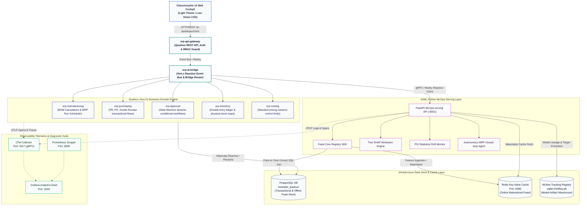
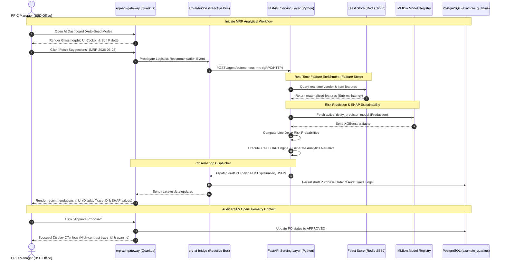

# Piero AI-ERP Platform — Multi-Module Observable Reactive ERP & MLOps Engine

Piero AI-ERP is a production-grade, enterprise-ready **AI-Native Manufacturing & MLOps Orchestration** platform designed to bridge traditional transactional ERP systems with an adaptive, transparent, autonomous, and real-time auditable MLOps architecture.

The system is designed using strict **Domain-Driven Design (DDD)** principles across a multi-module Maven codebase, powered by a non-blocking reactive backend built on **Java 21 / Quarkus v3**, an enterprise feature store using **Feast (PostgreSQL + Redis)**, **Tree SHAP** visualization for model interpretability, an automated retraining pipeline triggered by **Population Stability Index (PSI)** data drift detection, and an **Autonomous Closed-Loop Agentic Planning** engine that securely dispatches draft Purchase Orders directly into the transactional ERP system.

---

## Key Features & Capabilities

* **Distributed Modular Monolith Backend:** Built in Java 21 / Quarkus v3 utilizing Vert.x reactive event buses, gRPC, and Kafka for decoupled domain workflows (Manufacturing, Purchasing, Approval, Inventory, Costing).
* **Enterprise Feature Store (Feast):** Syncs PostgreSQL (offline training features) and Redis (low-latency online inference cache) to prevent training-serving data skew.
* **Explainable AI (Tree SHAP):** Translates raw model features into human-readable narratives to give operators complete transparency into AI delay predictions.
* **Closed-Loop Agentic MRP:** Autonomous PPIC and Purchasing agents coordinate to detect material shortages, optimize vendor selection, and insert validated draft Purchase Orders directly back into Quarkus.
* **Population Stability Index (PSI) Monitoring:** Periodically compares real-time input distributions against baselines, triggering automated MLflow model retraining when drift exceeds tolerances ($PSI > 0.20$).

---

## Distributed Architecture & DDD

The platform separates the concerns of transactional business logic (Java/Quarkus) and analytical model serving (Python/FastAPI) using high-performance gRPC and reactive Vert.x Event Bus routing.

---

## AI-ERP MLOps Subsystem

The analytical layer coordinates three dedicated machine learning pipelines: the **Production Delay Predictor (XGBoost)** with Tree SHAP explainability, the **Costing Anomaly Detector (Isolation Forest)**, and the **MRP Advisor Agent (Qwen 2.5 LLM + LoRA)**.

```mermaid
flowchart TB
    classDef client fill:#0f172a,stroke:#38bdf8,color:#e0f2fe,stroke-width:2px,font-weight:bold
    classDef api fill:#1e1b4b,stroke:#818cf8,color:#e0e7ff,stroke-width:1.5px
    classDef monitor fill:#052e16,stroke:#4ade80,color:#dcfce7,stroke-width:1.5px
    classDef train fill:#431407,stroke:#fb923c,color:#fed7aa,stroke-width:1.5px
    classDef storage fill:#172554,stroke:#60a5fa,color:#dbeafe,stroke-width:1.5px
    classDef step fill:#2d1500,stroke:#f97316,color:#ffedd5,stroke-width:1px,font-style:italic

    %% Interface Layer
    subgraph InterfaceLayer["1. Enterprise ERP & UI Layer"]
        ERP["PieroERP Quarkus Backend<br/>(Java Microservices)"]:::client
        VueDashboard["Vue.js Interactive Dashboard<br/>(Main Frontend)"]:::client
        AgentWS["Agent Chat Workspace<br/>(MRP Advisor UI)"]:::client
    end

    %% High-Performance FastAPI Serving Layer
    subgraph ServingLayer["2. AI-ERP FastAPI Gateway (Port :8001)"]
        APIGateway["FastAPI Server Main Entry<br/>(api/main.py)"]:::api
        
        DelayRouter["Delay Predictor Router<br/>(api/routers/delay_predictor.py)"]:::api
        AnomalyRouter["Anomaly Detector Router<br/>(api/routers/anomaly_detector.py)"]:::api
        MRPRouter["MRP Advisor Router<br/>(api/routers/mrp_advisor.py)"]:::api
        MonitorRouter["Observability Router<br/>(api/routers/monitoring.py)"]:::api
        AgentRouter["Agent Copilot Router<br/>(api/routers/agent.py)"]:::api
        
        PredictService["Unified Inference Service<br/>(api/services/predictor.py)"]:::api
        ModelLoader["Dynamic Model Loader<br/>(api/services/model_loader.py)"]:::api
    end

    %% Routing Connections
    ERP -->|REST Predict Queries| APIGateway
    VueDashboard -->|Analytical Requests| APIGateway
    AgentWS -->|Agent Chat Queries| APIGateway

    APIGateway --> DelayRouter
    APIGateway --> AnomalyRouter
    APIGateway --> MRPRouter
    APIGateway --> MonitorRouter
    APIGateway --> AgentRouter

    DelayRouter --> PredictService
    AnomalyRouter --> PredictService
    MRPRouter --> PredictService
    AgentRouter --> PredictService
    PredictService --> ModelLoader

    %% Production Audit & Observability
    subgraph MonitoringLayer["3. MLOps Drift & Performance Monitoring"]
        DriftChecker["Population Stability Drift Checker<br/>(src/drift_check.py)"]:::monitor
        AuditLogger["JSON Performance Auditor<br/>(src/utils.py)"]:::monitor
    end

    PredictService -->|Record Inference Telemetry| AuditLogger
    MonitorRouter -->|Trigger PSI Checks| DriftChecker

    %% Storage & Feature Store Layer
    subgraph StorageLayer["4. Storage & Feature Store Layer"]
        FeatureStoreDB[("Centralized Feature Store<br/>(src/feature_store.py)")]:::storage
        Dataset[("Engineered Master Splits<br/>outputs/model_table.csv")]:::storage
        BaselineSpecs[("Target Baseline Specs<br/>outputs/*_baseline.json")]:::storage
        AuditLogs[("JSON Audit & Prediction Logs<br/>logs/prediction_audit.json")]:::storage
        LocalModelStore[("Local Serialization Storage<br/>models/*.joblib & mrp_advisor_lora/")]:::storage
    end

    ModelLoader -->|Load Local Pipelines / LoRA weights| LocalModelStore
    AuditLogger -->|Write Inference Record| AuditLogs
    DriftChecker -->|Parse Inference Records| AuditLogs
    DriftChecker -->|Compare Baselines| BaselineSpecs

    %% Offline Training & Orchestration Layer
    subgraph TrainingPipeline["5. Offline Training & MLOps Orchestration Layer"]
        Extractor["ERP PostgreSQL Extractor<br/>(src/data_extractor.py)"]:::train
        FeatureEngine["Feature Engineering Engine<br/>(src/feature_engineering.py)"]:::train
        Trainer["Training Orchestration Runner<br/>(src/training_pipeline.py)"]:::train
        ModelPipeline["Preprocess & Classifier Fits<br/>(src/train.py)"]:::train
        Evaluator["Metrics Validator<br/>(src/evaluate.py)"]:::train
        
        subgraph Steps18["Comprehensive 18-Step ML Lifecycle Orchestrator"]
            S1["1. Load Master Table Data"]:::step
            S2["2. Time-Based / Chrono Split"]:::step
            S3["3. Identify Input Columns"]:::step
            S4["4. Build X/y Train-Test Matrices"]:::step
            S5["5. Ready Preprocess Pipeline Spec"]:::step
            S6["6. Fit Estimator (XGBoost/IF/Qwen LoRA)"]:::step
            S7["7. Serialize Local Binaries"]:::step
            S8["8. Save Feature Base Schemas"]:::step
            S9["9. Predict Test Partition Validation"]:::step
            S10["10. Compute Recall / F1-Scores / PPL"]:::step
            S11["11. Log MLflow Run Metadata"]:::step
            S12["12. Register Named Model in Registry"]:::step
            S13["13. Move Version to Staging Stage"]:::step
            S14["14. Check Production Threshold Criteria"]:::step
            S15["15. Promote Target Model to Production"]:::step
            S16["16. Reload Active Production Pipeline"]:::step
            S17["17. Check with Verification Sample"]:::step
            S18["18. Log Setup Verification Trails"]:::step
        end

        MLflowDB[("MLflow Registry & SQLite DB<br/>sqlite:///mlflow.db")]:::train
    end

    %% Data Orchestration Connections
    Extractor -->|Fetch ERP Schemas| FeatureStoreDB
    FeatureStoreDB -->|Ingest Core Features| FeatureEngine
    FeatureEngine -->|Compile Model Tables| Dataset
    FeatureEngine -->|Publish Feature Baselines| BaselineSpecs

    Trainer -.-> Steps18
    S1 -->|Fetch Split Inputs| Dataset
    S6 --> ModelPipeline
    S7 -->|Serialize Models| LocalModelStore
    S10 --> Evaluator
    S11 -->|Log Run Metrics & Checkpoints| MLflowDB
    S12 -->|Register Model Version| MLflowDB
    S13 -->|Promote to Staging| MLflowDB
    S15 -->|Promote to Active Production| MLflowDB
    S18 -->|Write verification record| AuditLogs
```

---

## Closed-Loop Data Flow: Shortage Event to Automated PO Draft

This sequence diagram illustrates the automated closed-loop decision workflow, which coordinates real-time data lookups from Feast, predictive inferences from MLflow, Tree SHAP explanation rendering, and transactional draft PO commits inside the PostgreSQL DB:

---

## Interactive User Interface & Observability

The client cockpit dashboard (`/ai-dashboard.html`) is built as a responsive, low-strain glassmorphic interface:
* **Visual Ergonomics:** Soft warm colors off-white (`#f5f7fa`) with Slate-800 text reduce ocular fatigue for operators during long operational shifts.
* **Mock Data Seeding:** Integrates a preloaded seeding switch that automatically initializes test cases for demo purposes.
* **Deep Telemetry Integration:** Displays real-time **Trace ID** and **Span ID** values mapped through OpenTelemetry context propagation, enabling operators to instantly trace actions from the UI down to specific PostgreSQL database transactions.

---

## User Interface Gallery

Below is a visual comparison of the traditional transactional ERP panels and the intelligent, low-glare analytical cockpit used by manufacturing operators:

### Transactional ERP Control Center

The primary transactional user interface managing material master data, Bill of Materials (BOM), purchasing records, and inventory ledgers with dual database ACID compliance.

---

### Intelligent AI-Native MLOps Cockpit

An autonomous decision cockpit displaying real-time explainability (Tree SHAP charts), auto-seeding simulation options, high-contrast OpenTelemetry metrics (Trace ID & Span ID propagation), and role-playing simulator panels.
