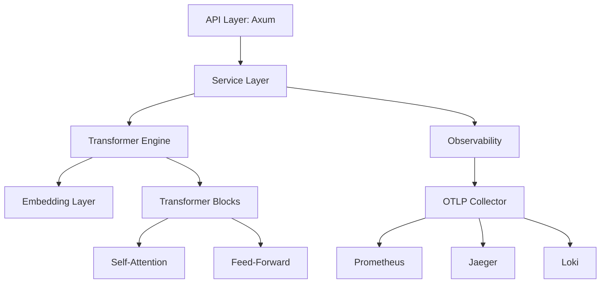

# SanedgeGPT

SanedgeGPT is a high-performance, lightweight implementation of a Generative Pre-trained Transformer (GPT) architecture, engineered from the ground up using Rust. This project serves as a technical demonstration of modern transformer principles, robust software engineering practices, and integrated observability in a low-level systems programming environment.

---

## Overview

SanedgeGPT implements a minimalist yet fully functional GPT-style model. It abstracts complex linear algebra operations into a modular architecture, featuring a custom-built transformer core, an asynchronous API layer, and a production-grade observability stack. The project is designed for researchers and engineers seeking a deep understanding of LLM internals without the overhead of massive frameworks.

---

## Core Architecture

The model architecture is built upon the foundational principles of the Transformer as described in "Attention Is All You Need."

### Transformer Components

- **Multi-Head Self-Attention**: Implements the scaled dot-product attention mechanism, allowing the model to weigh the importance of different segments of the input sequence.
- **Feed-Forward Networks (FFN)**: Dual-layered linear transformations with non-linear activation functions applied independently to each position.
- **Layer Normalization**: Applied before each sub-layer to stabilize the training process and improve convergence.
- **Residual Connections**: Implemented around each sub-layer to facilitate gradient flow and enable the training of deeper architectures.
- **Positional Embeddings**: Categorical and temporal encoding to provide the model with sequence order information.

---

## Technology Stack

- **Language**: Rust (2024 Edition) – utilizing zero-cost abstractions and memory safety.
- **Linear Algebra**: `ndarray` for high-performance multidimensional array processing.
- **Asynchronous Runtime**: `tokio` for non-blocking I/O and task orchestration.
- **Web Framework**: `axum` for providing a high-concurrency RESTful API.
- **Serialization**: `serde` and `bincode` for efficient data handling and model persistence.

---

## Architecture Diagram



---

## Observability and Monitoring

SanedgeGPT is integrated with a sophisticated observability stack based on the OpenTelemetry standard, ensuring full visibility into system performance and model behavior.

- **Distributed Tracing**: Integration with **Jaeger** via OTLP gRPC to track request propagation and identify bottlenecks in model inference.
- **Metrics Collection**: System and application-level metrics exported to **Prometheus**, providing real-time data on throughput, latency, and resource utilization.
- **Structured Logging**: High-performance JSON logging using `tracing-subscriber`, aggregated in **Grafana Loki** for centralized analysis.
- **Dashboarding**: Pre-configured **Grafana** dashboards for a unified view of the system's operational health.

---

## API Documentation

The application exposes a RESTful interface for interaction and management.

### Endpoint Specifications

| Method | Endpoint | Description |
| :--- | :--- | :--- |
| `GET` | `/health` | Returns the operational status of the service. |
| `GET` | `/api/model/info` | Retrieves metadata including architecture parameters and parameter counts. |
| `POST` | `/api/generate` | Generates text sequences based on a provided starting prompt. |

### Generation Request Example

```json
{
  "prompt": "The future of AI in Rust is",
  "max_tokens": 50,
  "temperature": 0.7
}
```

---

## Getting Started

### Prerequisites

- **Rust Toolchain**: 1.85.0 or later (Stable, 2024 Edition).
- **Docker Compose**: Required for deploying the observability infrastructure.

### Installation and Deployment

**1. Environment Configuration**

Clone the repository and configure the environment variables:

```bash
# Create .env from the following template
DEV_MODE=true
ENABLE_FILE_LOG=false
```

**2. Infrastructure Provisioning**

Launch the monitoring services:

```bash
docker-compose up -d
```

**3. Application Execution**

Compile and run the server:

```bash
cargo run
```

The service will be accessible at `http://localhost:5000`.

---

## Observability Previews

### Model Training Monitoring


### System Memory Allocation


### Log Aggregation


